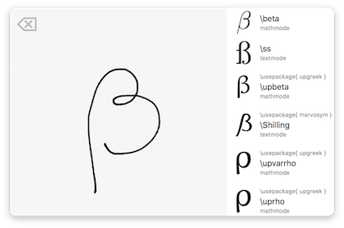

<!--Container Based Execution Stack for Neural Networks / Benjamin Nussbaum / University of Vienna-->

<!--This thesis presents an execution stack for neural networks using the Kubernetes container orchestration and a Java based microservice architecture, which is exposed to users and other systems via RESTful webservices. The whole workflow including importing, training and evaluating a neural network model, becomes possible by using this service oriented approach. This work is influenced by N2Sky, a framework for the exchange of neural network specific knowledge and aims to support ViNNSL, the Vienna Neural Network Specification Language. The execution stack runs on many common cloud platforms. Furthermore it is scalable and each component is extensible and interchangeable. -->

# Introduction

This thesis presents an execution stack for neural networks using the *Kubernetes*[^0] container orchestration and a Java based microservice architecture, which is exposed to users and other systems via RESTful web services and a web frontend. The whole workflow including importing, training and evaluating a neural network model, becomes possible by using this service oriented approach (SOA). The presented stack runs on popular cloud platforms, like *Google Cloud Platform*[^1], *Amazon AWS*[^2] and *Microsoft Azure*[^3]. Furthermore it is scalable and each component is extensible and interchangeable. This work is influenced by N2Sky \cite{schikuta_2013}, a framework to exchange neural network specific knowledge and aims to support *ViNNSL*, the Vienna Neural Network Specification Language \cite{kopica_2015} \cite{beran_2008}. 

##### Objectives:

The first objective is to specify functional and non-functional requirements for the neural network system.  This is followed by the characterisation of the API and the implemention of microservices that later define the neural network composition as a collection of loosly coupled services.

The next step is to setup a *Kubernetes* cluster to create the foundation of container orchestration. 

Finally the microservices are deployed to containers and combined in a cluster. 

##### Non-Objectives: 

The prototype does not fully implement the *ViNNSL 2.0*, as described in \cite{kopica_2015} and provides limited data in-/output. This is described in section TODO.

## Motivation

Machine learning has become a highly discussed topic in information technology in the past years and the trend is further increasing. It has become an essential part of everyday life when using search engines or speech recognition systems, like personal assistants. Self-learning algorithms in applications learn from the input of their users and decide which news an individual should read next, which song to listen to or which social media post should appear first. Messages are being analyzed and possible answers automatically predicted. 

A recent Californian study shows that 6.5 million developers worldwide are currently involved in projects that use artificial intelligence techniques and another 5.8 million developers expect to implement these in near future \cite{evans}.

Machine learning is not just a business area in the United States, survey results of 264 companies in the DACH region show, that 56 of them already use that kind of technology in production. In the near future 112 companies plan to do so or already have initial experiences (see figure \ref{img.crisp_ml_verbreitung}). It is seen by a fifth of the decision-makers as a core area to improve the competitiveness and profitability of companies in future. \cite{crisp}

\bilds{crisp_ml_verbreitung}{Distribution of machine learning of 264 companies in the DACH region \cite{crisp}}{Distribution of machine learning in 264 companies (DACH region) \cite{crisp}}

At the same time more and more companies shift their business logic from a monolithic design to microservices. Each service is dedicated to a single task that can be developed, deployed, replaced and scaled independently.  Test results have shown that not only this architecture can help reduce infrastructure costs \cite{villamizar2}\cite{villamizar}, but also reduces complexity of the code base and enables applications to dynamically adjust computing resources on demand \cite{villamizar}.

The presented project combines these techniques and demonstrates a prototype that is open-source and is supported by common cloud providers. Developers can integrate their own solutions into the platform or exchange components ad libitum.

## Structure

TODO

<!--Following the specification of ViNNSL by Kopica \cite{kopica_2015} this thesis provides a basic implementation of the markup language used to define the structure--> 

## Problem Statement

TODO

* many different platforms
* complex field, hard to learn
* complex setup for many environments (design, training, auswertung, storage service, …)

# State of the Art

## Machine Learning

*Machine learning—the process by which computers can get better at performing tasks through exposure to data, rather than through explicit programming—requires massive computational power, the kind usually found in clusters of energy-guzzling, cloud-based computer servers outfitted with specialized processors. But an emerging trend promises to bring the power of machine learning to mobile devices that may lack or have only intermittent online connectivity. This will give rise to machines that sense, perceive, learn from, and respond to their environment and their users, enabling the emergence of new product categories, reshaping how businesses engage with customers, and transforming how work gets done across industries.(https://www2.deloitte.com/insights/us/en/focus/signals-for-strategists/machine-learning-mobile-applications.html)*  TODO CITATION

### Classification

#### LATEX Symbol classification application

### Neural Network Frameworks

#### Tensorflow

#### Deeplearning4J

## Container Orchestration

### Docker Containers

Containers enable software developers to deploy applications that are portable and consistent across different environments and providers \cite{baier-kub} by running isolated on top of the operating system's kernel \cite{bashari}. As an organisation, Docker[^4] has seen an increase of popularity very quickly, mainly because of its advantages, which are speed, portability, scalability, rapid delivery, and density \cite{bashari}.

Building a Docker container is fast, because they are small and build in a few seconds without the overhead of a virtual machine. The container format itself is standardized, which means that developers only have to ensure that their application runs inside the container, which is then bundled into a single unit. The unit can be deployed on any Linux system as well as on various cloud environments and therefore easily be scaled. Not using a full operating system makes containers use less resources than virtual machines, which ensures higher workloads with greater density. \cite{joy2015}

### Microservices

TODO As we break down an application into very specific domains, we need a uniform way to communicate between all the various pieces and domains. Web services have served this purpose for years, but the added isolation and granular focus that containers bring have paved a way for what is being named microservices.  \cite{baier-kub}

> TODO In short, the microservice architectural style is an approach to developing a
> single application as a suite of small services, each running in its own process and communicating with lightweight mechanisms, often an HTTP resource API. These services are built around business capabilities and independently deployable by fully automated deployment machinery. There is a bare minimum of centralized management of these services, which may be written in different programming languages and use different data storage technologies. (deloitte)

\bild{monolithic_vs_microservice}{15cm}{Monolithic Architecture vs. Microservice Architecture}{Monolithic Architecture vs. Microservice Architecture}

<!---->

### Comparison of Container Orchestration Technologies

### Kubernetes

TODO Kubernetes is a system, developed by Google, for managing containerized applications across a cluster of nodes. The controlling services in a Kubernetes cluster are called the master components and have a number of unique services which are used to manage a cluster's workload and communications across the system\cite{kub_intro}. 

### Docker Swarm

### Kubernetes 

# Requirements

## Functional Requirements

## Non-Functional Requirements 

# Specification

## Neural Network Objects

### State of Neural Network Objects

\bild{nn-states}{15cm}{State Machine of a Neural Network}{State Machine of a Neural Network}

# Designing the API

Restful  API

## Open API

swagger yaml

# Implementation of a Prototype 

## User Interface

\bild{vinnsl-nn-ui}{15cm}{User Interface of Prototype}{User Interface of Prototype}

# Use Cases

1) iris classification

2) MNIST?

3) hosted trained network

# Future Work

TODO

* more function  
* backend für tensorflow
* grafischer NN designer
* trainierte netzwerke als webservice veröffentlichen

# Conclusions 

# Acknowledgments 

# Dedication 

# Appendices

[^1]: https://cloud.google.com/kubernetes-engine
[^2]: https://aws.amazon.com/eks
[^3]: https://azure.microsoft.com/services/container-service
[^0]: https://kubernetes.io
[^4]: https://docker.com