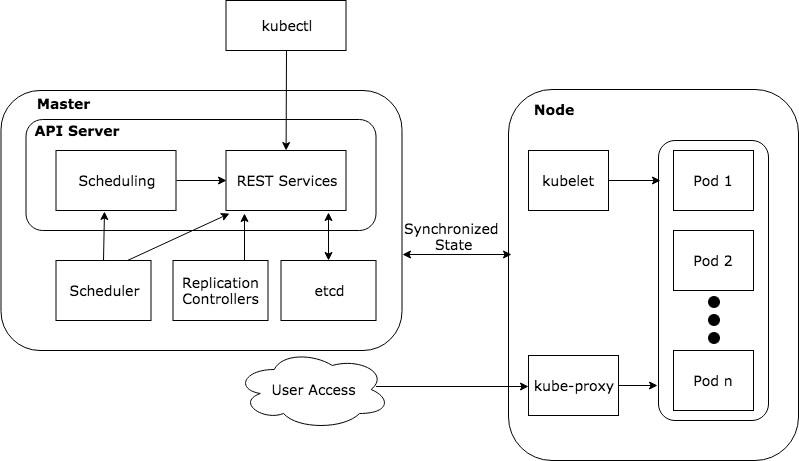

<!--Container Based Execution Stack for Neural Networks / Benjamin Nussbaum / University of Vienna-->

<!--This thesis presents an execution stack for neural networks using the Kubernetes container orchestration and a Java based microservice architecture, which is exposed to users and other systems via RESTful webservices. The whole workflow including importing, training and evaluating a neural network model, becomes possible by using this service oriented approach. This work is influenced by N2Sky, a framework for the exchange of neural network specific knowledge and aims to support ViNNSL, the Vienna Neural Network Specification Language. The execution stack runs on many common cloud platforms. Furthermore it is scalable and each component is extensible and interchangeable. -->

# Introduction

This thesis presents an execution stack for neural networks using the *Kubernetes*[^0] container orchestration and a Java based microservice architecture, which is exposed to users and other systems via RESTful web services and a web frontend. The whole workflow including importing, training and evaluating a neural network model, becomes possible by using this service oriented approach (SOA). The presented stack runs on popular cloud platforms, like *Google Cloud Platform*[^1], *Amazon AWS*[^2] and *Microsoft Azure*[^3]. Furthermore it is scalable and each component is extensible and interchangeable. This work is influenced by N2Sky \cite{schikuta_2013}, a framework to exchange neural network specific knowledge and aims to support *ViNNSL*, the Vienna Neural Network Specification Language \cite{kopica_2015} \cite{beran_2008}. 

##### Objectives:

The first objective is to specify functional and non-functional requirements for the neural network system.  This is followed by the characterisation of the API and the implemention of microservices that later define the neural network composition as a collection of loosly coupled services.

The next step is to setup a *Kubernetes* cluster to create the foundation of container orchestration. 

Finally the microservices are deployed to containers and combined in a cluster. 

##### Non-Objectives: 

The prototype does not fully implement the *ViNNSL* in version 2.0, as described in \cite{kopica_2015} and provides limited data in-/output. Limitations are described in section \ref{limitations}.

## Problem Statement

Getting started with machine learning and in particular with neural networks is not a trivial task. It is a complex field with a high entry barrier and most often requires programming skills and expertise in neural network frameworks. In most cases a complex setup is needed to train and evaluate networks, which is both, a processor- and memory-intense job. With cloud computing getting more and more affordable and powerful, it makes sense to shift these tasks into the cloud. There are already existing cloud platforms for machine learning, but to my present research all of them do not fulfil at least one of the following criteria:

* platform is open-source
* no programming skills required to define and train a neural network model
* can be deployed on-site and and in the cloud (of your choice)
* components extensible and replaceable by developers
* provides a RESTful interface

This thesis showcases an architecture, that tries to achieve all of that.

 <!--TODO why it is important -->

<!--This thesis showcases an architecture, that is open-source and integrates with ViNNSL, a descriptive neural network language that does not require programming skills. It can run locally on every computer or in the cloud. All components are small microservices -- replaceable and extensible. REST services are provided which allows external services to integrate with the platform.-->


<!--What is the problem?-->
<!--Who has the problem?-->
<!--Where does the problem occur?-->
<!--When does the problem occur?-->
<!--How often does the problem occur?-->
<!--What causes the problem?-->
<!--What does the problem impact?-->

## Motivation

Machine learning has become a highly discussed topic in information technology in the past years and the trend is further increasing. It has become an essential part of everyday life when using search engines or speech recognition systems, like personal assistants. Self-learning algorithms in applications learn from the input of their users and decide which news an individual should read next, which song to listen to or which social media post should appear first. Messages are being analyzed and possible answers automatically predicted. 

A recent Californian study shows that 6.5 million developers worldwide are currently involved in projects that use artificial intelligence techniques and another 5.8 million developers expect to implement these in near future \cite{evans}.

Machine learning is not just a business area in the United States. Survey results of 264 companies in the DACH region show, that 56 of them already use that kind of technology in production. In the near future 112 companies plan to do so or already have initial experiences (see figure \ref{img.crisp_ml_verbreitung}). It is seen by a fifth of the decision-makers as a core area to improve the competitiveness and profitability of companies in future. \cite{crisp}

<!--\bilds{crisp_ml_verbreitung}{Distribution of machine learning of 264 companies in the DACH region \cite{crisp}}{Distribution of machine learning in 264 companies (DACH region) \cite{crisp}}-->

{width=10cm}

At the same time more and more companies shift their business logic from a monolithic design to microservices. Each service is dedicated to a single task that can be developed, deployed, replaced and scaled independently.  Test results have shown that not only this architecture can help reduce infrastructure costs \cite{villamizar2}\cite{villamizar}, but also reduces complexity of the code base and enables applications to dynamically adjust computing resources on demand \cite{villamizar}.

The presented project combines these techniques and demonstrates a prototype that is open-source and supported by common cloud providers. Developers can integrate their own solutions into the platform or exchange components ad libitum.

It also integrates with ViNNSL, a descriptive language that does not require programming skills to define, train and evaluate neural networks.

## Structure

This thesis gives an introduction and comparison to state of the art technologies that support the microservice architecture pattern using container and container orchestration tools. This is followed by the acquaintance of Machine Learning (ML) and commonly used ML Frameworks. Featuring all these introduced technologies, requirements are defined for the implementation of a prototype. Main sections of this thesis are the specification, implementation and documentation of the prototype following common practices.  To demonstrate the operational purposes of the prototype, two use cases are presented. 

Future work mentions ideas on how the prototype can be extended and integrated into other systems and the conclusion summarizes the motivation and archivements of the implemented neural network execution stack.

<!--Following the specification of ViNNSL by Kopica \cite{kopica_2015} this thesis provides a basic implementation of the markup language used to define the structure--> 

## Related Work

### ViNNSL

The Vienna Neural Network Specification Language (*ViNNSL*) is a domain specific language developed by the University of Vienna to describe neural network objects and is designed as a communication framework in service-oriented architectures. It is based on XML and provides the schemas that allow the creation, training and evaluation of artificial neural networks. \cite{beran_2008} 

### N2Sky

*N2Sky* is a cloud-based platform developed by the University of Vienna that follows the Neural Networks as a Service paradigm and provides an implementation example of *ViNNSL*. It is designed as virtual collaboration platform allowing to exchange neural network knowledge with a neural network community. The service delivers an interface to create and train neural network objects and subsequently share them with the community. \cite{schikuta_2013}\cite{n2sky-2}

# State of the Art

## Containers

### Docker Containers

Containers enable software developers to deploy applications that are portable and consistent across different environments and providers \cite{baier-kub} by running isolated on top of the operating system's kernel \cite{bashari}. As an organisation, Docker[^4] has seen an increase of popularity very quickly, mainly because of its advantages compared to other solutions, which are speed, portability, scalability, rapid delivery and density \cite{bashari}.

Building a Docker container is fast, because images do not include a guest operating system. The container format itself is standardized, which means that developers just have to ensure that their application runs inside the container, which is then bundled into a single unit. The unit can be deployed on any Linux system as well as on various cloud environments and therefore easily be scaled. Not using a full operating system makes containers use less resources than virtual machines, which ensures higher workloads with greater density. \cite{joy2015}

## Microservices

The micoservice architecture pattern is a variant of a service-oriented architecture (SOA).  An often cited definition originates from Martin Fowler and James Lewis:

> In short, the microservice architectural style is an approach to developing a single application as a suite of small services, each running in its own process and communicating with lightweight mechanisms, often an HTTP resource API. These services are built around business capabilities and independently deployable by fully automated deployment machinery. There is a bare minimum of centralized management of these services, which may be written in different programming languages and use different data storage technologies. \cite{lewis2014microservices}

Figure \ref{monolithic_vs_microservice} shows the architectural difference between the monolithic and microservice architecture. Monolithic applications bundle user interface, data access layer and business logic together as a single unit. In the microservice architecture each task has its own service. The user interface puts information together from multiple services.

{width=15cm}

## Container Orchestration Technologies

As every single microservice runs as a container, we need a tool to manage, organise and replace these containers. Services should also be able to speak to each other and to be restarted if they fail. Services under heavy load should be scaled for better performance. To deal with these challenges container orchestration technologies come into place.  According to a study from 2017 published by Portworx, Kubernetes is the most frequently used container orchestration tool in organizations, followed by Docker Swarm and Amazon ECS. \cite{portworx-2017}

This section describes the architecture of the mentioned container orchestration technologies and compares them.

### Kubernetes

Kubernetes is the third container-management system (after Borg and Omega) developed by Google \cite{Burns:2016uq} for administering applications, that are provided in containers, in a cluster of nodes. Services that are responsible for controlling the cluster, are called master components \cite{kub_intro}. Figure \ref{kubernetes_core_architecture} shows the Kubernetes core architecture, which includes the Master server, the nodes and the interaction between the components.

{width=15cm}

#### Master Components

The master consists of the core API server, that provides information about the cluster and workload state and allows to define the desired state \cite{baier-kub}. The master server also takes care of scheduling and scaling workloads, cluster-wide networking and performs health checks \cite{kub_intro}. Workloads are managed in form of so-called pods, which are various containers that conclude the application stacks \cite{baier-kub}.

##### etcd

Etcd is a key-value store, accessible by a HTTP/JSON API,  which can be distributed across multiple nodes and is used by Kubernetes to store configuration data, which needs to be accessible across nodes deployed in the cluster. It is essential for service discovery and to describe the state of the cluster, among other things. \cite{kub_intro}

Etcd can also watch values for changes \cite{baier-kub}.

##### kube-apiserver

The API server acts as the main management point for the cluster and provides a RESTful interface for users and other services to configure workloads in the cluster. It is a bridge between other master components and responsible of maintaining health and spreading commands in the cluster. \cite{kub_intro}

##### kube-scheduler

The scheduler keeps track of available and allocated resources on each specific node in the cluster. It has an overview of the infrastructure environment and needs to distribute workload to an acceptable node without exceeding the available resources. Therefore each workload has to declare its operating requirements. \cite{kub_intro}

##### kube-controller-manager

The controller manager mainly operates different controllers that constantly check the shared state of the cluster in `etcd` via the apiserver \cite{kub_comp} and if the current state differs towards the desired state it takes compensating measures \cite{kub_intro}. 

For example the node controller's task is to react when nodes go offline or down. The replication controller makes sure that the defined number of desired pods is identical to the number of currently deployed pods in the cluster and scales applications up or down accordingly. The endpoints controller populates the endpoints to services \cite{kub_comp} 

##### cloud-controller-manager

Kubernetes supports different cloud infrastructure providers. As each cloud provider has different features, apis and capabilities, cloud controller managers act as an abstraction to the generic internal Kubernetes constructs. This has the advantage that the core Kubernetes code is not dependent on cloud-provider-specific code. \cite{kub_comp} 

#### Node Components

Servers that accomplish workloads are called nodes. Each workload is described as one or more container/s that has/have to be deployed. Node components run on every node in the cluster, providing the Kubernetes runtime environment \cite{kub_comp}, that establishes networking and communicates with the master components. They also take care of deploying the necessary containers on a node and keep them running \cite{kub_intro}. Kubernetes requires a dedicated subnet for each node server and a supported container runtime \cite{kub_comp}.

##### kubelet

The kubelet is the primary agent running on each node in the cluster, responsible for running pods \cite{kub_comp}. It communicates with the API server to receive commands invoked by the scheduler. Interaction takes place with the etcd store to read and update configuration and state of the pod.

Pods are specified by the *PodSpec*, which defines the workload and parameters on how to run the containers \cite{kub_intro}. The kubelet process is responsible that the containers described in the specification are running and healthy \cite{kub_comp}. 

##### kube-proxy

The proxy service is in charge of forwarding requests of defined services to the correct containers. On a basic level, load balancing is also done by the proxy. \cite{baier-kub}

##### Container Runtime

The container runtime is an implementation running containers. Currently Docker, rkt, runc and OpenContainer runtimes are supported. \cite{kub_comp}

##### Pods

A pod is the smallest deployable unit in a cluster consisting of a group of one or more containers, which share network and storage. \cite{kub-pod}

#### Addons

##### Cluster DNS

Cluster DNS server keeps track of running services in the cluster and updates DNS records accordingly. This allows an easy way of service discovery. Containers include this DNS server in their DNS lookups automatically -- that way a service can resolve another service by its name. \cite{baier-kub}

##### Ingress

Ingress handles the traffic from outside the cluster and forwards it to the correct service using the dns service acting as a proxy server. Currently there are two official implementations: `ingress-gce` and `ingress-nginx`. *Ingress* also provides basic load balancing. \cite{kub-ingress}

##### Dashboard

The dashboard is a web-based user interface that allows to manage *Kubernetes* clusters and applications running in the cluster \cite{kub_comp}. It also provides access to log messages in each pod.

#### Minikube

Minikube is a tool to run a single-node Kubernetes cluster locally on computers supporting various virtual machine drivers.

### Docker Swarm Mode

*Docker Swarm Mode* is the successor of *Docker Swarm* and implements a cluster management and orchestration tooling directly built into *Docker*[^doc] . 

#### Components

Docker hosts can run in swarm mode, a swarm consists of one or more hosts that act as managers and workers. Hosts can be managers, which means delegators of work, or workers, that run services, or both. \cite{dock-swarm}

##### Service
Services are definitions of tasks that will be executed on manager or worker nodes, specified by which container image to use and which commands to execute \cite{dock-swarm}.

A service has attributes attached to it, that define its optimal state. 

Services can be replicated, attached to storage and network resources and expose ports to the outside, defined by attributes. You can change the attributes while runtime, without restarting a service. \cite{dock-swarm}

<!--For **global services**, the swarm runs one task for the service on every available node in the cluster.-->

##### Task 

A task is a running container itself which is assigned to the service. It is managed by the *swarm manager*. Manager nodes assign tasks to worker nodes, respecting the service scale.\cite{dock-swarm}

<!--A **task** carries a Docker container and the commands to run inside the container. It is the atomic scheduling unit of swarm. Manager nodes assign tasks to worker nodes according to the number of replicas set in the service scale. Once a task is assigned to a node, it cannot move to another node. It can only run on the assigned node or fail.-->

##### Nodes

A node is a Docker instance that is a participant in the the *swarm*. Nodes are typically distributed across multiple physical machines (in the cloud), but can also run on a single computer. \cite{dock-swarm}

##### Manager Nodes

Manager nodes are responsible for deploying applications and dispatching tasks to worker nodes. Secondly one elected leader manager node supervises functions to maintain the desired state of the swarm (defined by the service). \cite{dock-swarm}

##### Worker nodes 

Worker nodes execute tasks from the manager nodes and notify them about the current state of its tasks.\cite{dock-swarm}

##### Load balancing & DNS

Like Kubernetes, the swarm manager uses ingress to expose and load balance services. 

An internal DNS component assigns each service a DNS entry automatically.  \cite{dock-swarm}

#### Announcements

On October 17, 2017 at the conference *DockerCon*[^doccon], Docker announced that it would integrate Kubernetes into the Docker platform. 

<!--https://github.com/GuillaumeRochat/container-orchestration-comparison-->

[^doc]: https://docker.com
[^doccon]: https://europe-2017.dockercon.com/

### Comparison

#### Community

The following table shows a comparison of publicly available metrics on *GitHub*, trying to represent community interest in the previously mentioned orchestrator softwares. Both projects are open-sourced and released under the *Apache-2.0*[^apl] license. These metrics were collected on June 21, 2018 and are rounded to the nearest ten. Comparing the numbers it can be assumed that the open-source community has currently a stronger interest in the Kubernetes project. In July 2018, Kubernetes won the *OSCON Most Impact Award* at the O'Reillys Open Source Conference \cite{heise-oscon}.

|              | Kubernetes [^kubrepo] | Docker Swarm Mode [^swarmrepo] |
| ------------ | -------------------- | ----------------------------- |
| Contributors | 1.700                | 165                           |
| Commits      | 66.820               | 3.530                         |
| Stars        | 37.830               | 5.150                         |
| Forks        | 13.220               | 1.060                         |

[^kubrepo]: https://github.com/kubernetes/kubernetes
[^swarmrepo]: https://github.com/docker/swarm
[^apl]: http://www.apache.org/licenses/LICENSE-2.0

#### Feature Differentiation 

The handling of *Docker Swarm Mode* and Kubernetes is similar in many aspects, like load balancing with Ingress, service discovery via DNS, and the definition language YAML. Auto-scaling, which means increasing or decreasing running instances of a service as the load changes over time, is not directly available in *Docker Swarm Mode*, in contrast to Kubernetes. 

*Docker Swam Mode* provides the possibility to mount local volumes or folders into a container.  Kubernetes has two APIs available: Volumes and Persistent Volumes. Volumes are an abstraction with several different implementations for cloud storages (like AWS, Azure) and are bound to the lifecycle of a pod. Once a pod is removed, also the volume data is gone. Persistent Volumens allow data to be persisted independently from a pod.

Both technologies provide an easy to install development environment. Kubernetes is available via the minikube package as well as in the newest version of Docker Community Edition. Docker Swarm Mode is also available via the Docker application.

### Decision

Taking into account the community size, the feature-richness and the out-of-the-box support by the major players Amazon AWS, Microsoft Azure and Google Cloud Engine, Kubernetes is the selected technology for the presented execution stack.

## Machine Learning

The term *machine learning* originates from a 1959 article by Arthur Samuel \cite{Samuel59somestudies} presenting a method how computers can learn to play a better game of checkers than human.

Today, as a research area within artificial intelligence, machine learning is generally known as the process that trains computers to improve performance specific tasks through exposure to data, rather than through explicit programming by using statistical techniques. It is used to conceive complex models that lead themselves to prediction. 

There are different approaches to machine learning, like decision trees or predicition rules \cite{michalski2013machine}. This thesis focuses on neural networks. 

## Neural Networks

Neural networks, or more correctly artificial neural networks, are derived from the neural system of the human brain. Neurons are the basic element of the nervous system and can be divided into three essential features: the dendrites, the soma and the axon. The human brain consists of about 10 billon neurons, which communicate through a network of axons and synapses. Artificial neural networks try to imitate this connection. \cite{haun1998simulation}

### Classification of Neural Networks

This thesis focuses on Backpropagation networks, but to provide a general overview, Figure \ref{nn_class_haun} shows a classification of neural networks by Haun \cite{haun1998simulation} divided into three levels based on connection type, neuronal behavior and learning methods. The first level classifies into feedback and feedforward networks. The second level into linear and non-linear networks, the third one into supervised and non-supervised networks.

#### Feedforward networks 

Feedforward networks consist of connections in one direction only. Neurons are connected between different layers and normally spread from input to output through hidden layers. The output can be calculated from the input directly. Loops are not allowed \cite{haun1998simulation}.

##### Linear and non-linear networks

Linear networks use linear activation functions. The output of a neuron is bound directly to the value of activation function. Non-linear networks use non-linear activation functions, which means that the activation value is one, if the sum of all input values exceed a threshold value, otherwise it is zero.   \cite{haun1998simulation} 

A Perceptron network is for example a linear network.

##### Supervised and unsupervised networks

Supervised networks compare its output values with the correct answer during training and continuously adapt input values to approximate both values. Unsupervised networks do not have such information and must learn through an inherent mechanism. It is presumed that impulses and reactions relate in a way that produces correct behaviour after the learning period is finished. \cite{haun1998simulation}

#### Feedback networks

Feedback networks are networks where neurons are also connected between different layers, but the output of a neuron can be connected to an input of another neuron. Output values are therefore dependant from previous input values of the neural network. \cite{haun1998simulation} Feedback networks are further grouped into defined constructed networks and trained networks. Defined constructed networks already have a defined structure when the data is presented, for example Hopfield networks. Trained networks can be trained with supervised and unsupervised training, for example the ART-1 (Adaptive Resonance Theory). \cite{haun1998simulation}


 {width=15cm}

### Backpropagation Networks

Backpropagation is not a network design per se, but a supervised learning algorithm. It is used for example in Multi-Layer-Perceptrons. The purpose is to change weights on hidden layers in the network, based on a calculated (net) output error, to improve network accuracy. \cite{nn-froehlich}

An input vector is forward-propagated through all layers until the output layer, which is compared to the desired output. This step results in the error values using a loss function. In process of backpropagation the weights are then updated to minimize the loss function. The process is repeated until the net error is approximately zero. \cite{nn-froehlich}

### Neural Network Frameworks

Neural network frameworks provide an abstraction and simplification to complex programming challenges \cite{dzone-frameworks} regarding neural network models and the simulation of the training and evaluation processes. Developers are given helper functions to build a network according to their liking. Most frameworks also provide implementations of the backpropagation algorithm, activation functions and data structures to load training data into memory. Frameworks can also help to transform raw data, like images, into data that is more suitable to neural network training. 

There are currently many popular neural network frameworks on the market. Google's TensorFlow is having the biggest impact in terms of contributions and community (see Comparison).

#### TensorFlow

TensorFlow[^tegit] is an open-sourced framework, released under the Apache 2.0[^te] license, that was developed by the *Google Brain Team* as successor to the proprietary software DistBelief, which was used for research on various use cases including unsupervised learning, image classification, object detection and many more. TensorFlow is an interface and implementation for machine learning algorithms, featuring support for a wide range of devices (from mobile phones to server hardware) and GPU cards. \cite{dean-tensor}

According to Google's whitepaper \cite{dean-tensor}, in their implementation, a *tensor* is a typed, multidimensional array, that supports a variety of tensor element types . It can be seen as abstraction to scalars, vectors and matrices \cite{raschka2017machine}. 

TensorFlow computations are expressed as directed dataflow graph, in which each node has zero or more inputs and outputs. Values, called tensors, flow along the edges of the graph. \cite{dean-tensor}. Figure \ref{tensor-flow-graph} shows a matrix multiplication of input *X*  with a matrix *W*. Vector *b* is then added to this matrix terminating in output *O*.

These computations can be executed on either on local or the distributed implementation, on a single or multiple devices \cite{dean-tensor}.

{width=6cm} 

##### TensorFlow Programming Stack

The TensorFlow programming stack consists of multiple API layers, as is illustrated in Figure \ref{tensorflow-api-levels}. On the lowest level, the TensorFlow Kernel, is the distributed execution engine. The low-level APIs are implemented in different programming languages, including Python, C++, Java and Go. Currently only Python provides higher-level TensorFlow APIs. 

The mid-level API provides access to layers, datasets and metrics, the high-level API adds estimators, which encapsulate training, evaluation and prediction of models \cite{tensorflow-estimators}.


##### Implementation Example

For framework demonstration purposes, the source code classifying the Iris dataset from the first use case (see section \ref{iris-classification-example}) implemented using TensorFlow is attached in the appendix section \ref{tensorflow-implementation-example}.

[^te]: http://www.apache.org/licenses/LICENSE-2.0
[^tegit]: https://github.com/tensorflow/tensorflow


#### Deeplearning4J

Deeplearning4J is an open-source machine learning library by the Eclipse Foundation released under the Apache 2.0 license. It provides a set of components, to read from various data sources and build neural networks. Deeplearning4J provides support for CPU and GPU processing. \cite{wired-dl4j}

For large processing, the framework supports Hadoop, a way of scaled data storing and processing across numerous computer servers \cite{wired-dl4j}.

##### ND4J

The framework is built on top of ND4J, a numerical computing engine, which implements n-dimensional array objects (tensors) for Java \cite{nd4j-intro}. It is a library, that is optimized for GPU processing with a CUDA backend and supports all common operations to manipulate matrices \cite{nd4j-intro}. Parts of core are written in C++ to increase performance of numerical operations \cite{nd4j-benchmarking}.

##### Main Features

The framework supports convolutional and recurrent nets and deep nets of various types. Furthermore it provides implementation of backpropagation and optimization algorithms, various activation- and loss functions as well as hyperparameters. \cite{dl4j-features}

The user interface features a computation graph and visualization tools, further explained in section \ref{training}.

##### Implementation Example

For framework demonstration purposes, the source code also classifying the Iris dataset using Deeplearning4J is attached in the appendix section \ref{deeplearning4j-implementation-example}.

#### Further Neural Network Frameworks

There are several other popular neural network frameworks \cite{dzone-frameworks}, that should be mentioned here. The following table lists this projects including their website. 

| Framework Name                   | Projekt Website                                   |
| -------------------------------- | ------------------------------------------------- |
| Caffe                            | http://caffe.berkeleyvision.org                   |
| Microsoft Cognitive Toolkit/CNTK | https://www.microsoft.com/en-us/cognitive-toolkit |
| PyTorch                          | https://pytorch.org                               |
| Keras                            | https://keras.io/                                 |

#### Comparison

##### Community

Statistics (like *stars*, *contributors* and *forks*) of open-source projects hosted on the version control platform GitHub, increasingly influence the community and other developers. Every user on GitHub can show interest in a project by giving it a star, or copy the complete source code (a fork). Programmers that contributed code to a project are called contributors. In a blog article[^leaf], the founder of a machine learning framework called *Leaf* announced the suspension of the development. The announcement featured a screenshot that compared Leaf to TensorFlow by the amount of stars on GitHub. 

TensorFlow is currently the leading framework in terms of stars and contributors. Backed by Google, TensorFlow is fully integrated into the Google Cloud and Android platform. It has also been adopted by several large companies, like IBM, Twitter and Airbus \cite{dzone-frameworks}. Furthermore tech blogs rather report on TensorFlow than other framworks. A Google search for TensorFlow on the popular tech blog *DZone.com* returns over 5.300 results, while Deeplearning4J got less than 500 (as of July 17, 2018). The following table compares the statistics of the two mentioned projects on GitHub.

|              | TensorFlow [^tens] | Deeplearning4J [^dl4j] |
| ------------ | ------------------ | ---------------------- |
| Contributors | 1.500              | 225                    |
| Commits      | 36.450             | 23.260                 |
| Stars        | 105.120            | 9.320                  |
| Forks        | 65.410             | 4.350                  |

[^leaf]: https://medium.com/@mjhirn/tensorflow-wins-89b78b29aafb
[^tens]: https://github.com/tensorflow/tensorflow
[^dl4j]: https://github.com/deeplearning4j/deeplearning4j


### Decision

The prototype in this thesis will be implemented in the Java programming language. Deeplearning4J is based on C/C++ with a Java based library on top, while TensorFlow is based on Python. Deeplearning4J has a clear and understandable framework architecture, broad support for machine learning algorithms and data transformation. It further offers a model import tool for TensorFlow models. From the author's point of view, the source code of Deeplearning4J programs is cleaner and easier to interpret, as well as the transformation from the ViNNSL to Deeplearning4J is preferable to alternatives. 

As part of future work it is desirable to implement a native TensorFlow worker service in addition to Deeplearning4J.

# Requirements

This section defines functional and non-functional requirements for the developed prototype. The neural network execution stack focuses on two main target groups: data scientists and developers.  

Data scientists use the provided services in a deployed environment (cloud or own computer) to develop and train their neural networks. The system should be easy to setup and no programming knowledge should be needed to get started.  

Developers can extend the neural network stack with features or use the provided web services to implement their own custom solution. 

## Functional Requirements

Due to the fact that neural network training requires a lot of computing power, the main requirement is to design an architecture that can be executed in the cloud or on-site cluster hardware. 

To enable developers to extend the application, it is designed as a platform that is open-sourced and documented. The easy setup on local computers and the micro-services, that feature a clear structure and manageable code base, make it easier to get acquainted with the architecture. 

The neural network platform should also offer a way to be extended or used by external applications and services, therefore a documented RESTful webservice is provided, that can be consumed by various clients. 

<!--TODO-->

<!--NN in Cloud Rechnen-->

<!--Verwendung der verständlichen Beschreibungssprache ViNNSl-->

<!--all Devices, from everywhere-->

<!--berechnetes Netzwerk kann in eig App verwendet werden / oder als Webservice exposed-->

### User Interface

The user interface shall be a web application that gives a quick overview of all neural networks and their training status. The frontend uses the RESTful API as backend source and does not cover the whole function range of the API. 

#### Mockup

Figure \ref{vinnsl-ui-mockup} shows a sketch of the user interface. On the left side the user can see a list of all created or imported neural networks. Next to the names of the networks, there is an icon representing the training status. In the detailed view on the right side, the title and id of the network is shown followed by an indicator when training is in progress. The visualisation of a neural network is divided into tabs.

The tabs "Description", "Definition", "Instance" and "Result" represent the eponymous ViNNSL Description XML file into a graphical tree view. When enough information is provided by ViNNSL XML files, the worker service performs a transformation into the internally used model representation of the *Deeplearning4J* Framework. The *Deeplearning4J* Tab shows the transformed object. In the "Files" tab, imported files of the storage services are listed and can be selected as training- or testset.

{width=17cm}

## Non-Functional Requirements 

### Quality

The execution stack shall comply with the following quality features:

* Standard RESTful API
* the user interface works on all common browsers and devices (responsive design)
* loading time of the user interface should be less than three seconds

### Technical

### Software

- Kubernetes
- Docker
- Java Standard Platform
- Maven Plugin for Java

### Hardware

* Kubernetes compatible hardware or Cloud account (Amazon Web Services, Google Cloud Engine)

### Documentation

The documentation is provided in Section \ref{prototype-api-documentation} or online on SwaggerHub[^7].

### Source Code

The source code is released on GitHub [^6].

### Developer Environment

Developers can use any Java Based development  environment. 


# Specification

## Use Case

Figure \ref{img.use_case_nn} shows the UML use case diagram. 

{width=15cm}

### Use Case Descriptions

| **Use Case**            | **Import Neural Network**                                    |
| ----------------------- | ------------------------------------------------------------ |
| Description             | An existing ViNNSL XML file with a neural network description is imported via the vinnsl web service into the database. |
| Priority                | primary                                                      |
| Actors                  | Data Scientist                                               |
| Preconditions           | ViNNSL neural network XML description file                   |
| Postconditions          | —                                                            |
| Normal Course of Events | * The actor sends a POST request to the ViNNSL web service including a XML body<br />* The web service validates and imports the XML file and returns the HTTP status code 201 CREATED |
| Alternative Courses     | * The post request is sent by an application or other service |
| Exceptions              | If the validation fails or an error occurs, the web service returns the HTTP status code 500 |
| Assumptions             | Access to the `vinnsl-service`                               |

| **Use Case**            | **Train Neural Network**                                     |
| ----------------------- | ------------------------------------------------------------ |
| Description             | An imported neural network is trained by passing the configuration over to the worker service. |
| Priority                | primary                                                      |
| Actors                  | Data Scientist                                               |
| Preconditions           | Imported ViNNSL neural network XML description, definition and instance file |
| Postconditions          | —                                                            |
| Normal Course of Events | * The actor sends a POST request to the working service including the identifier of the neural network that should be trained<br />* The webservice validates the request, adds the network into the training queue and returns the HTTP status code 200. |
| Alternative Courses     | * The post request is sent by an application or other service |
| Exceptions              | If the validation fails or an error occurs, the webservice returns the HTTP statuscode 500 |
| Assumptions             | Access to the `vinnsl-nn-worker`                             |
| Extensions              | * Monitor Training Status <br />* Evaluate Neural Network    |

| **Use Case**            | **Monitor Training Status**                                  |
| ----------------------- | ------------------------------------------------------------ |
| Description             | The Data Scientist monitors the training status to evaluate the trained network afterwards. |
| Priority                | secondary                                                    |
| Actors                  | Data Scientist                                               |
| Preconditions           | Training of neural network started                           |
| Postconditions          | —                                                            |
| Normal Course of Events | * The actor sends a GET request to the status endpoint of the vinnsl service including the identifier of the neural network that is in progress.<br />* The web service validates the request, and returns the training status along the HTTP status code 200. |
| Alternative Courses     | * The post request is sent by an application or other service |
| Exceptions              | If the validation fails or an error occurs, the web service returns the HTTP statuscode 500 |
| Assumptions             | Access to the `vinnsl-service`                               |
| Extensions              | —                                                            |

| **Use Case**            | **Evaluate Neural Network**                                  |
| ----------------------- | ------------------------------------------------------------ |
| Description             | The Data Scientist evaluates the accuracy of the network after its training |
| Priority                | primary                                                      |
| Actors                  | Data Scientist                                               |
| Preconditions           | Training of neural network successfully finished             |
| Postconditions          | —                                                            |
| Normal Course of Events | * The actor sends a GET request to the status endpoint of the vinnsl service including the identifier of the neural network that is finished.<br />* The web service validates the request, and returns the ViNNSL XML file including the result scheme. |
| Alternative Courses     | * The post request is sent by an application or other service |
| Exceptions              | If the validation fails or an error occurs, the webservice returns the HTTP statuscode 500 |
| Assumptions             | Access to the `vinnsl-service`                               |
| Extensions              | —                                                            |

| **Use Case**            | Upload Files                                                 |
| ----------------------- | ------------------------------------------------------------ |
| Description             | The Data Scientist uploads files, that are usable as datasets (f.ex. CSV files or pictures) to the storage service |
| Priority                | primary                                                      |
| Actors                  | Data Scientist                                               |
| Preconditions           | —                                                            |
| Postconditions          | —                                                            |
| Normal Course of Events | * The actor sends a POST request to the storage service endpoint containing a multipart file.<br />* The web service validates the request, and returns the unique identifier of the file along the HTTP status code 200. |
| Alternative Courses     | * The post request is sent by an application or other service<br/>* The file is uploaded with the provided HTML upload form provided by the storage service |
| Exceptions              | If the upload fails or an error occurs, the web service returns the HTTP statuscode 500 |
| Assumptions             | Access to the `vinnsl-storage-service`                       |
| Extensions              | —                                                            |

| **Use Case**            | **List Neural Networks**                                     |
| ----------------------- | ------------------------------------------------------------ |
| Description             | Imported neural networks are listed                          |
| Priority                | primary                                                      |
| Actors                  | Data Scientist                                               |
| Preconditions           | Imported ViNNSL neural network XML description file          |
| Postconditions          | —                                                            |
| Normal Course of Events | * The actor sends a GET request to the ViNNSL web service optionally including a neural network identifier<br />* The web service validates and returns the XML file(s). |
| Alternative Courses     | The request is sent by an application or other service       |
| Exceptions              | If the validation fails or an error occurs, the web service returns the HTTP statuscode 500 |
| Assumptions             | Access to the `vinnsl-service`                               |

| **Use Case**            | **Extend Service**                                           |
| ----------------------- | ------------------------------------------------------------ |
| Description             | An existing micro service can be extended by developers      |
| Priority                | secondary                                                    |
| Actors                  | Developer                                                    |
| Preconditions           | source code and developer environment present                |
| Postconditions          | —                                                            |
| Normal Course of Events | * The developer downloads the source code and extends functionality of a micro service<br/>* The modified service is deployed into kubernetes |
| Alternative Courses     | —                                                            |
| Exceptions              | —                                                            |
| Assumptions             | —                                                            |

| **Use Case**            | **Replace Service**                                          |
| ----------------------- | ------------------------------------------------------------ |
| Description             | An existing micro service can be replaced by developers      |
| Priority                | secondary                                                    |
| Actors                  | Developer                                                    |
| Preconditions           | source code and developer environment present                |
| Postconditions          | —                                                            |
| Normal Course of Events | * The developer writes a new implementation of an existing service respecting the API definition (see API Docuentation)<br/>* The service is deployed into kubernetes |
| Alternative Courses     | —                                                            |
| Exceptions              | —                                                            |
| Assumptions             | —                                                            |

<!--TODO (hinzufügen: dev: kann trainiertes netz in eigener app verwenden ,data scientist: trainiertes netzwerk exportieren und developer überreichen)-->

## Sequence Diagram

Figure \ref{img.training_sequence} shows the sequence diagram of a neural network training process and which microservices are involved in the communication. The *vinnsl service* is the main communication hub that enables access to the neural network object and all of its data and also provides interfaces to update it. The *vinnsl storage service* most importantly stores necessary binary data used by the neural network objects. On one hand that are tables and pictures on the other hand the binary (trained) *Deeplearning4J* model. The *vinnsl worker service* has the role of training the neural network models.

### Sequence of Training

New neural networks are created by sending a `POST` request including a XML ViNNSL network description in the request body. The *vinnsl service* creates a new neural network based on the definition and answers with the HTTP status code 201 (CREATED). The location header points to the URL where the created network can be retrieved. The URL contains the unique identifier. Using this identifier the next step is to add the ViNNSL definition XML file to the network. This is done via a `POST` request appending the id and the `/definition` endpoint. The XML file is placed in the request body. Resources that are required for the training (like the training set) need to be uploaded to the storage service, which returns a unique file id. Before the training can start, the training set needs to be linked to the neural network. This is possible with the `/addfile` endpoint. 

Next, the network is marked for training by calling the worker service with its identifier. The worker service confirms that the training is queued. As soon as the training is finished, the worker service updates the neural network object with the result schema and uploads the trained binary model to the storage service for retraining. 

A simple `GET` request to the vinnsl service along with the identifier returns the current trained neural network model. 


{width=15cm}

## Data Model Design

### vinnsl-service

All neural network data managed by the `vinnsl-service` is stored in a documented-oriented database. The saved documents will internally be mapped to Java Classes. The main object is `vinnsl`.

`vinnsl` is the primary object owning the `_id` field that is unique. The `nncloud` property stores the status of the network and the representation of the transformed *Deeplearning4J* network. `description`, `definition`, `instance`,  `training` and `result` represent the ViNNSL 2.0 Schema, generated from the provided XML Schema Definition files. See \cite{kopica_2015} to get a listing and description on all provided properties of ViNNSL 2.0. 

Figure \ref{img.db_schema} shows the data schema.

{width=15cm}

### storage-service

The `storage-service` stores binary files and their metadata, either directly in the file system or inside a database.  Each file needs to have a unique id, a filename, a content type and an upload date.

| Attribute field | Description                                                  |
| --------------- | ------------------------------------------------------------ |
| id              | a unique file id that can be referred to (f.ex in `vinnsl-service`) |
| filename        | the original filename when uploaded                          |
| content type    | the MIME type standardized in RFC 6838 (f.ex text/plain)     |
| upload date     | date and time of original upload                             |
| metadata        | a field for arbitrary additional information                 |

Example of stored file:

```
{
    "_id" : ObjectId("5ab4e69c8f136a16bf81f093"),
    "filename" : "iris.txt",
    "aliases" : null,
    "chunkSize" : NumberLong(261120),
    "uploadDate" : ISODate("2018-03-23T11:35:56.700Z"),
    "length" : NumberLong(2700),
    "contentType" : "text/plain",
    "md5" : "f0e89bd71f7bb9e584e685aeb178a5aa"
}
```


## Overview Microservices

The neural network cloud execution stack consists of four main services that expose a RESTful API to users and two supporting services in charge of persisting data. Figure \ref{img.overview_nn_architecture} displays an overview of the service architecture, including the exposed endpoints and storage backends.

{width=16.5cm}

### Vinnsl Service (vinnsl-service)

The `vinnsl-service` is responsible for handling the import, management and manipulation of neural network objects and their status. It maps the CRUD[^5] operations to HTTP methods. A new neural network is created by sending a `POST` request to the `/vinnsl` endpoint containing a ViNNSL Definition XML as body. Sending a `GET` request to the `/vinnsl` route returns a JSON containing all ViNNSL neural network objects. 

The `vinnsl-service` depends on the `vinnsl-db` service, which runs a MongoDB database to store the objects. 

### Worker Service (vinnsl-nn-worker)

The `vinnsl-nn-worker` implements a queue management for neural network training and transforms ViNNSL neural network models into *Deeplearning4J* models. It provides a wrapper of the *Deeplearning4J* platform, that handles the training or evaluation of the network.

### Storage Service (vinnsl-storage-service)

Binary files, like trained network models, images or csv files are essential in the pocess of creating and training neural networks. File management is handled by the `vinnsl-storage-service`.

### Frontend UI (vinnsl-nn-ui)

The Frontend UI is a web application that gives a brief overview of all neural network models, their training status and linked files.

## User Interface Design

Based on the mockup in section \ref{mockup}, a user interface design has been created, that will later be implemented as a web application. Buttons to import or delete a neural network and to refresh the user interface have been added to the design. 

Figure \ref{vinnsl-ui-design} shows the user interface design for the frontend web service.

{width=17cm}

## Service Discovery and Load Balancing

*Service Discovery* is the process of finding a way to connect to a specific service. This applies within the cluster, which is typically firewalled from the internet. As Kubernetes allows services to be scaled, there is also a logic that knows and decides how network traffic is routed. This is called *Load Balancing*. Figure \ref{img.service-discovery} shows an overview of the microservices, their endpoint URL and the domain name service. External access to specific services is managed by *Ingress*. 

### Kubernetes DNS-based Service Discovery

`kube-dns` is the Kubernetes add-on that starts a pod with a DNS service and configures the kubelets to resolve DNS names over this service. It listens on port 53, the standard DNS port. Services in a cluster are assigned a *DNS A record* derived from their service metadata name specified in the *ServiceSpec*. \cite{kub-dns-spec} 

The following code snippet is an extract of the *ServiceSpec* for the `vinnsl-service` defining the metadata name:

```
{
  "kind": "Service",
  "apiVersion": "v1",
  "metadata": {
    "name": "vinnsl-service",
    ...
  }
}
```

#### Structure of the Hostname

The full hostname record is composed of the zone, kind, namespace of the cluster and the metadata name of the service.

| Name     | Description                                                  |
| -------- | ------------------------------------------------------------ |
| zone     | the cluster domain (default using minikube: *cluster.local*) |
| kind     | kind of pod (default for services: *svc*)                    |
| ns       | namespace (default using minikube: *default*)                |
| hostname | hostname from service metadata name                          |

##### Example

The vinnsl-service running on a local minikube cluster gets the following DNS record name: `vinnsl-service.default.svc.cluster.local `.

#### Service Discovery

Using the Kubernetes DNS, a microservice instance (kubelet) can now lookup other services by using DNS Queries.

##### Example

For example the tool `nslookup`  can query the DNS service for the IP address of the `vinnsl-service` within the cluster.

```
/ # nslookup vinnsl-service
Server:    10.96.0.10
Address 1: 10.96.0.10 kube-dns.kube-system.svc.cluster.local

Name:      vinnsl-service
Address 1: 10.102.84.122 vinnsl-service.default.svc.cluster.local
```

In this example the service is reachable at the IP address *10.102.84.122*.

{width=15cm}

#### External Access and Load Balancing

External access from outside the cluster to specific services is managed and provided through the *Ingress* API object. The associated implementation is called *Ingress controller* and is obligatory. Currently there are two official implementations: `ingress-gce` and `ingress-nginx`. \cite{kub-ingress}

*Minikube* runs the `ingress-nginx` implementation as default and also provides basic load balancing by configuring a `nginx` [^8] web server. Kubernetes configures `nginx` to use the *least-connected* load balancing mechanism, which means that the *next request is assigned to the server with the least number of active connections* \cite{nginx-loadbal}.

[^8]: http://nginx.org/


## Neural Network Objects State

The state of neural network objects is saved in the `NnCloud` object. When the object is instantiated the default value is `CREATED`.  When the network is queued, the worker service gathers all the necessary data from the vinnsl and vinnsl storage service and changes the state to `QUEUED`. During the network training, the worker changes the state to `INPROGRESS`. As soon as the training is finished, the worker service uploads the results and updated network state to the storage service and subsequently changes the state to `FINISHED`. Trained networks can be queued for retraining: in that case the state returns to `QUEUED`.  If errors occur during the training process the state will be set to `ERROR`.

Figure \ref{nn-states} visualizes the state changes in a state machine.

<!--\bild{nn-states}{15cm}{State Machine of a Neural Network}{State Machine of a Neural Network}-->

{width=15cm}


# Prototype Implementation 

Following the specification, this section showcases an implementation of a prototype, using microservices glued together by *Kubernetes*. This represents the execution stack for neural networks. Backend components are realized with *Java* and the *Spring Boot* framework and expose a RESTful API. The processing and training of neural networks is done by the *Deeplearning4J* framework. Database and file storage are powered by *MongoDB*. The frontend service is implemented using *Vue.js* and the *Twitter Bootstrap* UI framework, visualizing and consuming backend services.


## Source Code

The source code of the implemented microservices is released on *GitHub*. The following table gives an overview of available services and their corresponding repository.

| Name                   | Repository Link                                     |
| ---------------------- | --------------------------------------------------- |
| vinnsl-service         | https://github.com/a00908270/vinnsl-service         |
| vinnsl-nn-ui           | https://github.com/a00908270/vinnsl-nn-ui           |
| vinnsl-storage-service | https://github.com/a00908270/vinnsl-storage-service |
| vinnsl-nn-worker       | https://github.com/a00908270/vinnsl-nn-worker       |

The *ViNNSL* XSD schema, specified in \cite{kopica_2015}, including (generated) examples, is released on GitHub with permission from Dipl.-Ing. Thomas Kopica. JAXB class generation of the XML files is already included in the release with the intention of making it easier to include *ViNNSL* into new services.

| Name          | Repository Link                            |
| ------------- | ------------------------------------------ |
| vinnsl-schema | https://github.com/a00908270/vinnsl-schema |

## Releases

Docker Contrainers ready for deployment in a *Kubernetes* cluster are released on *DockerHub*. The following table references the released repositories.

| Name                   | Repository Link                                            |
| ---------------------- | ---------------------------------------------------------- |
| vinnsl-service         | https://hub.docker.com/r/a00908270/vinnsl-service/         |
| vinnsl-nn-ui           | https://hub.docker.com/r/a00908270/vinnsl-nn-ui/           |
| vinnsl-storage-service | https://hub.docker.com/r/a00908270/vinnsl-storage-service/ |
| vinnsl-nn-worker       | https://hub.docker.com/r/a00908270/vinnsl-nn-worker/       |

## Framework Dependencies

All services are written in *Java* and built using the *Apache Maven* build automation and dependency management tool.

### Spring

*Spring* is a *Java* framework consisting of many modules. Most importantly this project uses its feature so set up `RestController` instances that listen on specified endpoints.

##### Used in following services:

`vinnsl-service`, ` vinnsl-nn-ui`, ` vinnsl-storage-service`,  `vinnsl-nn-worker`

#### Spring Boot

*Spring Boot* is an extension to the framework that allows *Java* applications to run stand-alone by embedding a web server directly into the application. \cite{spring-boot} 

##### Used in following services:

`vinnsl-service`, `vinnsl-nn-ui`, `vinnsl-storage-service`, `vinnsl-nn-worker`

#### Spring Data MongoDB

*Spring Data* provides an abstracted database access layer to MongoDB in form of a POJO (Plain Old Java Object). \cite{spring-data}

##### Used in following services:

`vinnsl-service`, `vinnsl-storage-service`

### Swagger

*Swagger* is used to generate a live documentation of all web service endpoints in this project and allows to try out requests directly in the user interface.

##### Used in following services:

`vinnsl-service`, `vinnsl-storage-service`,  `vinnsl-nn-worker`

### Fabric8

*Fabric8* packs the generated executables from the build process into a *Docker* container that can run in a *Kubernetes* cluster. 

##### Used in following services:

`vinnsl-service`, `vinnsl-nn-ui`, `vinnsl-storage-service`, `vinnsl-nn-worker`

### Deeplearning4J

*Deeplearning4J* is used by the worker service to train and evaluate neural networks.

A detailed introduction to Deeplearning4J can be found in Section \ref{deeplearning4j}.

##### Used in following services:

`vinnsl-nn-worker`

## Security

*Ingress* supports HTTPS encrypted connections. Authentication or restrictions are not implemented in the prototype.

## User Interface

### vinnsl-nn-ui (Frontend UI)

The `vinnsl-nn-ui` is a single page application (SPA) that displays all neural networks and their details in a web based frontend. Figure \ref{img.vinnsl-nn-ui} shows a screenshot of the user interface. 

{width=15cm}

#### Architecture

The web application is a Javascript based frontend, using the *Vue.js* and *Twitter Bootstrap* framework. The single main controller, called `VinnslUI`, provides methods to fetch a list of neural networks and their status.  Additionally it queries for available files from the storage service and enables to connect them to a neural network. 

## Endpoints

The following table gives an overview of the provided RESTful endpoints provided by different services. They are made available via *Ingress* outside the *Kubernetes* cluster.

| Service Name           | Exposed Endpoints             |
| ---------------------- | ----------------------------- |
| vinnsl-service         | `/vinnsl`, `/status`, `/dl4j` |
| vinnsl-nn-ui           | `/`                           |
| vinnsl-storage-service | `/storage`                    |
| vinnsl-nn-worker       | `/worker`                     |

### Additional Endpoints

Additional endpoints are used internally and are not directly exposed outside the *Kubernetes* cluster. They can be reached by using port forwarding to directly access the service in the cluster. 

##### /health

The health endpoints returns the status of the application. `UP` if the application is running as expected, `DOWN` if parts of the application fail (like lost connection to the database). *Kubernetes* and *Ingress* use this endpoint to detect disturbances in the application. 

##### /swagger

The API, provided by the services, is documented and *Swagger* provides a web interface to the documentation. 


<!--http://yuml.me/diagram/nofunky/class/edit/%2F%2F Cool Class Diagram, [VinnslUi|vinnslList:Object;currentVinnslItem:Object;|getStatus();getDetailsById(id);deleteById(id);getFiles();applyFile(id fileID);]-->

<!--\bild{vinnsl-nn-ui}{15cm}{User Interface of Prototype}{User Interface of Prototype} \label{vinnsl-nn-ui}-->

#### 

## Class Diagrams

This section features class diagrams of the provided RESTful services. All of them, as mentioned, are based on Java *Spring Boot* and use the *Spring Boot Data* layer if connecting to a database. 

### vinnsl-service

The *vinnsl service* is the main communication hub that enables access to the neural network objects and all of its data and provides interfaces to update it. The service connects to a *MongoDB* database where all its persisted data is stored via the *Spring Data* template. Fig. \ref{class_vinnsl-service} shows the class diagram of the *vinnsl service*.

#### VinnslServiceApplication

`VinnslServiceApplication` is the main class that initializes the *Spring Boot* configuration and *MongoDB* repository.

#### VinnslServiceController

`VinnslServiceController` is a *Spring* `RestController` implementing all Mappings for the endpoint `/vinnsl`. All required dependencies on *MongoDB* are injected by Spring Boot. 

#### NnStatusController

`NnStatusController` provides methods to get the current training status of one or all individual neural network(s). Methods are exposed at the `/status` endpoint. Other services, like the *vinnsl worker service* can also update the status.

#### Dl4JServiceController

`Dl4JServiceController` is a controller that allows manipulation of the *Deeplearning4J* property of a neural network using the `/dl4j` endpoint.

#### Vinnsl

The *vinnsl* class is a *POJO*[^po] representation of the *ViNNSL* XML structure and used across different services. 


[^po]: Plain Old Java Object

#### NnCloud

The `NnCloud` class is an extension to `Vinnsl`, used to store the status and the *Deeplearning4J* representation of a neural network.


{width=17cm}

### vinnsl-storage-service

The *vinnsl storage service* is a web service for storing and retrieving files in a *MongoDB* database. *GridFS*, which enables to store large data is activated. Figure \ref{class_vinnsl-storage-service} shows the class diagram.

#### VinnslStorageApplication

`VinnslStorageApplication` is the main class that initializes the *Spring Boot* configuration and *MongoDB* repository.

#### VinnslStorageController

`VinnslStorageController` makes retrieving and uploading files available via the `/storage` endpoint.

For one, there is an HTML form that enables a `Multipart` file upload from a browser, which is handled by the `handleFileUpload()` method. Secondly instead of directly uploading a file, a *URL* can be given as parameter via the `handleRestFileUploadFromUrl`. The storage service takes care of downloading and storing the file. The controller uses the *GridFS* template as an abstraction to the *MongoDB* database. 


{width=15cm}

### vinnsl-worker-service

The *vinnsl worker service* is the component, which is used for training and evaluating neural networks, executing the *Deeplearning4J* framework. Figure \ref{class_vinnsl-worker-service} shows the class diagram.

#### MappingUtil / VinnslDL4JMapperImpl

The classes `MappingUtil` and `VinnslDL4JMapperImpl` are responsible for mapping a *Vinnsl* to a *DeepLearning4J* network that can be trained.

The mappings are done in the inner classes of the `MappingUtil`. `VinnslDL4JMapperImpl` initializes the necessary objects and calls the right methods to perform the mapping.

#### Worker Controller

`WorkerController` is a `RestController` that exposes the `/worker/queue` endpoint and can be used to schedule neural networks for training.

#### WorkerQueue

`WorkerQueue` is the data structure that stores the identifiers of the queued networks in memory.

#### Worker

The worker class checks the `WorkerQueue` periodically and if not empty polls the first element. It fetches the associated *Vinnsl* network from the *vinnsl-service* and hands it over to the *Dl4JNetworkTrainer*. The service further sets the training status to `INPROGRESS`.  

#### Dl4JNetworkTrainer

The training is initiated by the `Worker` class. The *network trainer* fetches and parses the training data if necessary (for example *comma separed value* files) and initializes the `MappingUtil`. The transformed *Deeplearning4J* model contains the neural network structure and parameters, required for training and is attached to the *ViNNSL* model.

Next the *Deeplearning4J* `UI Server` is initialized, which visualizes the training process. Test and training data is split and the training is started. After the training process is finished, the result is uploaded to the storage service.  

{width=17cm}

### vinnsl-nn-ui

The frontend service consists of one single controller named `VinnslUI`. The `getStatus()` method retrieves all neural network ids and their status. This is stored in `vinnslList`. When selecting a neural network from the list, the neural network object is loaded by executing `getDetailsById()`. The response is stored in `currentVinnslItem`.

Figure \ref{vinnsl-nn-ui_class} gives an overview of the used methods and stored variables. 

{width=6cm}


## Limitations

### Neural Network Design

The prototyped ViNNSL to Deeplearning4J mapper currently supports only multi-layers and fully connected backpropagation networks.

### Parameters

The prototyped ViNNSL to Deeplearning4J mapper currently supports the following parameters:

1. learningrate
2. momentum
3. biasInput
4. epochs
5. threshold
6. activationfunction

# Prototype API Documentation

##### Base URL

```
http[s]://<clusterip>
```

## vinnsl-service

### Import a new ViNNSL XML Defintion

```
POST /vinnsl
```

#### Parameters

| Type     | Name                   | Description | Schema |
| -------- | ---------------------- | ----------- | ------ |
| **Body** | **vinnsl**  *required* | vinnsl      | Vinnsl |

#### Responses

| HTTP Code | Description  | Schema     |
| --------- | ------------ | ---------- |
| **201**   | Created      | No Content |
| **500**   | Server Error | Error      |

#### Consumes

- `application/xml`

#### Produces

- `*/*`

#### Tags

- vinnsl-service-controller

#### Example HTTP request

##### Header

```
Content-Type: application/xml
```

##### Body

```
<vinnsl>
  <description>
    <identifier><!-- will be generated --></identifier>
    <metadata>
      <paradigm>classification</paradigm>
      <name>Backpropagation Classification</name>
      <description>Iris Classification Example</description>
      <version>
        <major>1</major>
        <minor>0</minor>
      </version>
    </metadata>
    <creator>
      <name>Benjamin Nussbaum</name>
      <contact>nussbaum@institution.com</contact>
    </creator>
    <problemDomain>
      <propagationType type="feedforward">
        <learningType>supervised</learningType>
      </propagationType>
      <applicationField>Classification</applicationField>
      <networkType>Backpropagation</networkType>
      <problemType>Classifiers</problemType>
    </problemDomain>
    <endpoints>
      <train>true</train>
      <retrain>true</retrain>
      <evaluate>true</evaluate>
    </endpoints>
    <structure>
	   <input>
	    <ID>Input1</ID>
	    <size>
	    	<min>4</min>
	    	<max>4</max>
	    </size>
	   </input>
	   <hidden>
	    <ID>Hidden1</ID>
	    <size>
	    	<min>3</min>
	    	<max>3</max>
	    </size>
	   </hidden>
	   <hidden>
	    <ID>Hidden2</ID>
	    <size>
	    	<min>3</min>
	    	<max>3</max>
	    </size>
	   </hidden>
	   <output>
	    <ID>Output1</ID>
	    <size>
	    	<min>3</min>
	    	<max>3</max>
	    </size>
	   </output>
	 </structure>
	 <parameters/>
	 <data>
	 	<description>iris txt file with 3 classifications, 4 input vars</description>
	 	<tabledescription>no input as table possible</tabledescription>
	 	<filedescription>CSV file</filedescription>
	 </data>
  </description>
</vinnsl>
```
#### Example HTTP response

Statuscode: `201` CREATED

##### Header

```
Location: https://<baseURL>/vinnsl/5ade36bbd601800001206798
```

### List all Neural Networks

```
GET /vinnsl
```

#### Responses

| HTTP Code | Description  | Schema           |
| --------- | ------------ | ---------------- |
| **200**   | OK           | < Vinnsl > array |
| **404**   | Not Found    | No Content       |
| **500**   | Server Error | Error            |

#### Produces

- `application/json`

#### Tags

- vinnsl-service-controller

#### Example HTTP Response

```
[
    {
        "identifier": "5ab91658e8cc45946600ea11",
        "description": {},
        "definition": {},
        "data": {},
        "instance": {},
        "trainingresult": {},
        "result": {},
        "nncloud": {
            "status": "CREATED",
            "dl4jNetwork": "{}
        }
    },
    ...
]
```


### Delete all Neural Networks

```
DELETE /vinnsl/deleteall
```

#### Responses

| HTTP Code | Description  | Schema     |
| --------- | ------------ | ---------- |
| **200**   | OK           | object     |
| **204**   | No Content   | No Content |
| **500**   | Server Error | Error      |

#### Produces

- `application/json`

#### Tags

- vinnsl-service-controller

### Get Neural Network Object

```
GET /vinnsl/{id}
```

#### Parameters

| Type     | Name               | Description | Schema |
| -------- | ------------------ | ----------- | ------ |
| **Path** | **id**  *required* | id          | string |

#### Responses

| HTTP Code | Description | Schema     |
| --------- | ----------- | ---------- |
| **200**   | OK          | Vinnsl     |
| **404**   | Not Found   | No Content |

#### Produces

- `application/xml`
- `application/json`

#### Tags

- vinnsl-service-controller

#### Example HTTP response

```
<?xml version="1.0" encoding="UTF-8" standalone="yes"?>
<vinnsl>
    <identifier>5ab91658e8cc45946600ea11</identifier>
    <description>
        <identifier></identifier>
        <metadata>
            <paradigm>classification</paradigm>
            <name>Backpropagation Classification</name>
            <description>Face Recognition Example</description>
            <version>
                <major>1</major>
                <minor>5</minor>
            </version>
        </metadata>
        <creator>
            <name>Autor 1</name>
            <contact>author1@institution.com</contact>
        </creator>
        <problemDomain>
            <propagationType type="feedforward">
                <learningType>supervised</learningType>
            </propagationType>
            <applicationField>EMS</applicationField>
            <applicationField>Operations</applicationField>
            <applicationField>FaceRecoginition</applicationField>
            <networkType>Backpropagation</networkType>
            <problemType>Classifiers</problemType>
        </problemDomain>
        <endpoints>
            <train>true</train>
            <retrain>true</retrain>
            <evaluate>true</evaluate>
        </endpoints>
        <structure>
            <input>
                <ID>Input1</ID>
                <dimension>
                    <min>1</min>
                    <max>1</max>
                </dimension>
                <size>
                    <min>960</min>
                    <max>960</max>
                </size>
            </input>
            <hidden>
                <ID>Hidden1</ID>
                <dimension>
                    <min>1</min>
                    <max>1024</max>
                </dimension>
            </hidden>
            <output>
                <ID>Output1</ID>
                <dimension>
                    <min>1</min>
                    <max>1</max>
                </dimension>
                <size>
                    <min>1</min>
                    <max>1</max>
                </size>
            </output>
        </structure>
        <parameters/>
        <data>
            <description>Input are face images with 32x30 px</description>
            <tabledescription>no input as table possible</tabledescription>
            <filedescription>prepare the input as file by reading the image files</filedescription>
        </data>
    </description>
    <definition>
        <identifier></identifier>
        <problemDomain>
            <propagationType type="feedforward">
                <learningType>supervised</learningType>
            </propagationType>
            <applicationField>EMS</applicationField>
            <applicationField>Operations</applicationField>
            <applicationField>FaceRecoginition</applicationField>
            <networkType>Backpropagation</networkType>
            <problemType>Classifiers</problemType>
        </problemDomain>
        <endpoints></endpoints>
        <executionEnvironment>
            <serial>true</serial>
        </executionEnvironment>
        <structure>
            <input>
                <ID>Input1</ID>
                <dimension>1</dimension>
                <size>960</size>
            </input>
            <hidden>
                <ID>Hidden1</ID>
                <dimension>1</dimension>
                <size>1024</size>
            </hidden>
            <output>
                <ID>Output1</ID>
                <dimension>1</dimension>
                <size>1</size>
            </output>
            <connections/>
        </structure>
        <resultSchema>
            <instance>true</instance>
            <training>true</training>
        </resultSchema>
        <parameters>
            <valueparameter name="learningrate">0.4</valueparameter>
            <valueparameter name="biasInput">1</valueparameter>
            <valueparameter name="biasHidden">1</valueparameter>
            <valueparameter name="momentum">0.1</valueparameter>
            <comboparameter name="ativationfunction">sigmoid</comboparameter>
            <valueparameter name="threshold">0.00001</valueparameter>
            <comboparameter name="activationfunction">sigmoid</comboparameter>
        </parameters>
        <data>
            <description>Input are face images with 32x30 px</description>
            <dataSchemaID>iris.txt</dataSchemaID>
        </data>
    </definition>
    <data>
        <identifier>5ab4e69c8f136a16bf81f093</identifier>
        <data>
            <file>5ab4e69c8f136a16bf81f093</file>
        </data>
    </data>
</vinnsl>
```


### Remove Neural Network Object

```
DELETE /vinnsl/{id}
```

#### Parameters

| Type     | Name               | Description | Schema |
| -------- | ------------------ | ----------- | ------ |
| **Path** | **id**  *required* | id          | string |

#### Responses

| HTTP Code | Description  | Schema         |
| --------- | ------------ | -------------- |
| **200**   | OK           | ResponseEntity |
| **204**   | No Content   | No Content     |
| **500**   | Server Error | No Content     |

#### Produces

- `*/*`

#### Tags

- vinnsl-service-controller

### Add/Replace File of Neural Network

```
PUT /vinnsl/{id}/addfile
```

#### Parameters

| Type      | Name                   | Description | Schema |
| --------- | ---------------------- | ----------- | ------ |
| **Path**  | **id**  *required*     | id          | string |
| **Query** | **fileId**  *required* | fileId      | string |

#### Responses

| HTTP Code | Description  | Schema     |
| --------- | ------------ | ---------- |
| **200**   | OK           | Vinnsl     |
| **404**   | Not Found    | No Content |
| **500**   | Server Error | Error      |

#### Consumes

- `application/json`

#### Produces

- `application/xml`
- `application/json`

#### Tags

- vinnsl-service-controller

### Add/Replace ViNNSL Definition of Neural Network

```
PUT /vinnsl/{id}/definition
```

#### Parameters

| Type     | Name                | Description | Schema     |
| -------- | ------------------- | ----------- | ---------- |
| **Path** | **id**  *required*  | id          | string     |
| **Body** | **def**  *required* | def         | Definition |

#### Responses

| HTTP Code | Description  | Schema     |
| --------- | ------------ | ---------- |
| **200**   | OK           | Vinnsl     |
| **404**   | Not Found    | No Content |
| **500**   | Server Error | Error      |

#### Consumes

- `application/xml`
- `application/json`

#### Produces

- `*/*`

#### Tags

- vinnsl-service-controller

#### Example HTTP request

##### Request body

```
<definition>
<identifier><!-- will be generated --></identifier>
<metadata>
  <paradigm>classification</paradigm>
  <name>Backpropagation Classification</name>
  <description>Iris Classification Example</description>
  <version>
    <major>1</major>
    <minor>0</minor>
  </version>
</metadata>
<creator>
  <name>Ronald Fisher</name>
  <contact>ronald.fisher@institution.com</contact>
</creator>
<problemDomain>
  <propagationType type="feedforward">
    <learningType>supervised</learningType>
  </propagationType>
  <applicationField>Classification</applicationField>
  <networkType>Backpropagation</networkType>
  <problemType>Classifiers</problemType>
</problemDomain>
<endpoints>
  <train>true</train>
</endpoints>
<executionEnvironment>
	<serial>true</serial>
</executionEnvironment>
<structure>
   <input>
    <ID>Input1</ID>
    <size>4</size>
   </input>
   <hidden>
    <ID>Hidden1</ID>
    <size>3</size>
   </hidden>
   <hidden>
    <ID>Hidden2</ID>
    <size>3</size>
   </hidden>
   <output>
    <ID>Output1</ID>
    <size>3</size>
   </output>
   <connections>
   	<!--<fullconnected>
   		<fromblock>Input1</fromblock>
   		<toblock>Hidden1</toblock>
   		<fromblock>Hidden1</fromblock>
   		<toblock>Output1</toblock>
   	</fullconnected>-->
   </connections>
 </structure>
 <resultSchema>
 	<instance>true</instance>
 	<training>true</training>
 </resultSchema>
 <parameters>
 	<valueparameter name="learningrate">0.1</valueparameter>
	<comboparameter name="activationfunction">tanh</comboparameter>
	<valueparameter name="iterations">500</valueparameter>
	<valueparameter name="seed">6</valueparameter>
 </parameters>
 <data>
 	<description>iris txt file with 3 classifications, 4 input vars</description>
	<dataSchemaID>name/iris.txt</dataSchemaID>
 </data>
</definition>
```

### Add/Replace ViNNSL Instanceschema of Neural Network

```
PUT /vinnsl/{id}/instanceschema
```

#### Parameters

| Type     | Name                     | Description | Schema         |
| -------- | ------------------------ | ----------- | -------------- |
| **Path** | **id**  *required*       | id          | string         |
| **Body** | **instance**  *required* | instance    | Instanceschema |

#### Responses

| HTTP Code | Description  | Schema     |
| --------- | ------------ | ---------- |
| **200**   | OK           | object     |
| **404**   | Not Found    | No Content |
| **500**   | Server Error | Error      |

#### Consumes

- `application/xml`
- `application/json`

#### Produces

- `*/*`

#### Tags

- vinnsl-service-controller

#### Example HTTP request

##### Request body

```
<instanceschema>
</instanceschema>
```

### Add/Replace ViNNSL Resultschema of Neural Network

```
PUT /vinnsl/{id}/resultschema
```

#### Parameters

| Type     | Name                         | Description  | Schema       |
| -------- | ---------------------------- | ------------ | ------------ |
| **Path** | **id**  *required*           | id           | string       |
| **Body** | **resultSchema**  *required* | resultSchema | Resultschema |

#### Responses

| HTTP Code | Description  | Schema     |
| --------- | ------------ | ---------- |
| **200**   | OK           | object     |
| **404**   | Not Found    | No Content |
| **500**   | Server Error | Error      |

#### Consumes

- `application/xml`
- `application/json`

#### Produces

- `*/*`

#### Tags

- vinnsl-service-controller

#### Example HTTP request

##### Request body

```
<resultschema>
</resultschema>
```

### Add/Replace ViNNSL Trainingresult of Neural Network

```
PUT /vinnsl/{id}/trainingresult
```

#### Parameters

| Type     | Name                           | Description    | Schema               |
| -------- | ------------------------------ | -------------- | -------------------- |
| **Path** | **id**  *required*             | id             | string               |
| **Body** | **trainingresult**  *required* | trainingresult | Trainingresultschema |

#### Responses

| HTTP Code | Description  | Schema     |
| --------- | ------------ | ---------- |
| **200**   | OK           | object     |
| **404**   | Not Found    | No Content |
| **500**   | Server Error | Error      |

#### Consumes

- `application/xml`
- `application/json`

#### Produces

- `*/*`

#### Tags

- vinnsl-service-controller

#### Example HTTP request

##### Request body

```
<trainingresult>
</trainingresult>
```

### Get Status of all Neural Networks

```
GET /status
```

#### Responses

| HTTP Code | Description | Schema     |
| --------- | ----------- | ---------- |
| **200**   | OK          | object     |
| **404**   | Not Found   | No Content |

#### Produces

- `application/json`

#### Tags

- nn-status-controller

#### HTTP response example

```
{
    "5ab91658e8cc45946600ea11": "INPROGRESS"
}
```


### Get Status of Neural Network

```
GET /status/{id}
```

#### Parameters

| Type     | Name                 | Description | Schema |
| -------- | -------------------- | ----------- | ------ |
| **Path** | **id**    *required* | id          | string |

#### Responses

| HTTP Code | Description | Schema     |
| --------- | ----------- | ---------- |
| **200**   | OK          | object     |
| **404**   | Not Found   | No Content |

#### Produces

- `application/json`

#### Tags

- nn-status-controller

### Set Status of a Neural Network

```
PUT /status/{id}/{status}
```

#### Parameters

| Type     | Name                   | Description | Schema                                                |
| -------- | ---------------------- | ----------- | ----------------------------------------------------- |
| **Path** | **id**  *required*     | id          | string                                                |
| **Path** | **status**  *required* | status      | enum (`CREATED, QUEUED, INPROGRESS, FINISHED, ERROR`) |

#### Responses

| HTTP Code | Description  | Schema     |
| --------- | ------------ | ---------- |
| **200**   | OK           | object     |
| **404**   | Not Found    | No Content |
| **500**   | Server Error | Error      |

#### Consumes

- `application/json`

#### Produces

- `application/json`

#### Tags

- nn-status-controller

### Get Deeplearning4J Transformation Object of Neural Network

```
GET /dl4j/{id}
```

#### Parameters

| Type     | Name               | Description | Schema |
| -------- | ------------------ | ----------- | ------ |
| **Path** | **id**  *required* | id          | string |

#### Responses

| HTTP Code | Description | Schema     |
| --------- | ----------- | ---------- |
| **200**   | OK          | string     |
| **404**   | Not Found   | No Content |

#### Produces

- `application/json`

#### Tags

- dl4j-service-controller

### Put Deeplearning4J Transformation Object of Neural Network

```
PUT /dl4j/{id}
```

#### Parameters

| Type     | Name                 | Description | Schema |
| -------- | -------------------- | ----------- | ------ |
| **Path** | **id**  *required*   | id          | string |
| **Body** | **dl4J**  *required* | dl4J        | string |

#### Responses

| HTTP Code | Description  | Schema         |
| --------- | ------------ | -------------- |
| **200**   | OK           | ResponseEntity |
| **404**   | Not Found    | No Content     |
| **500**   | Server Error | Error          |

#### Consumes

- `application/json`

#### Produces

- `application/json`

#### Tags

- dl-4j-service-controller

## vinnsl-storage-service

### Handle File Upload from HTML Form
```
POST /storage
```


#### Parameters

|Type|Name|Description|Schema|
|---|---|---|---|
|**FormData**|**file**  <br>*required*|file|file|


#### Responses

|HTTP Code|Description|Schema|
|---|---|---|
|**200**|OK|string|
|**201**|Created|No Content|
|**404**|Not Found|No Content|


#### Consumes

* `multipart/form-data`


#### Produces

* `\*/*`


#### Tags

* vinnsl-storage-controller


### List all Files
```
GET /storage
```


#### Responses

|HTTP Code|Description|Schema|
|---|---|---|
|**200**|OK|[Model](#model)|
|**404**|Not Found|No Content|


#### Produces

* `application/json`


#### Tags

* vinnsl-storage-controller


### Download File by Original Filename
```
GET /storage/files/name/{filename}
```


#### Parameters

|Type|Name|Description|Schema|
|---|---|---|---|
|**Path**|**filename**  <br>*required*|filename|string|


#### Responses

|HTTP Code|Description|Schema|
|---|---|---|
|**200**|OK|string (byte)|
|**404**|Not Found|No Content|


#### Produces

* `\*/*`


#### Tags

* vinnsl-storage-controller


### Download or Show File by FileID
```
GET /storage/files/{fileId}
```


#### Parameters

|Type|Name|Description|Schema|
|---|---|---|---|
|**Path**|**fileId**  <br>*required*|fileId|string|
|**Query**|**download**  <br>*optional*|download|boolean|


#### Responses

|HTTP Code|Description|Schema|
|---|---|---|
|**200**|OK|string (byte)|
|**404**|Not Found|No Content|


#### Produces

* `\*/*`


#### Tags

* vinnsl-storage-controller


### Delete File by FileID
```
DELETE /storage/files/{fileId}
```


#### Parameters

|Type|Name|Description|Schema|
|---|---|---|---|
|**Path**|**fileId**  <br>*required*|fileId|string|


#### Responses

|HTTP Code|Description|Schema|
|---|---|---|
|**200**|OK|ResponseEntity|
|**204**|No Content|No Content|
|**403**|Forbidden|No Content|


#### Produces

* `\*/*`


#### Tags

* vinnsl-storage-controller


### Get File Metadata by FileID
```
GET /storage/metadata/{fileId}
```


#### Parameters

|Type|Name|Description|Schema|
|---|---|---|---|
|**Path**|**fileId**  <br>*required*|fileId|string|


#### Responses

|HTTP Code|Description|Schema|
|---|---|---|
|**200**|OK|< string, object > map|
|**404**|Not Found|No Content|


#### Produces

* `\*/*`


#### Tags

* vinnsl-storage-controller


### Upload MultipartFile
```
POST /storage/upload
```


#### Parameters

|Type|Name|Description|Schema|
|---|---|---|---|
|**FormData**|**file**  <br>*required*|file|file|


#### Responses

|HTTP Code|Description|Schema|
|---|---|---|
|**200**|OK|object|
|**201**|Created|No Content|
|**404**|Not Found|No Content|


#### Consumes

* `multipart/form-data`


#### Produces

* `application/json`


#### Tags

* vinnsl-storage-controller


### Upload File by URL
```
GET /storage/upload
```


#### Parameters

|Type|Name|Description|Schema|
|---|---|---|---|
|**Query**|**url**  <br>*required*|url|string|


#### Responses

|HTTP Code|Description|Schema|
|---|---|---|
|**200**|OK|object|
|**404**|Not Found|No Content|


#### Produces

* `application/json`


#### Tags

* vinnsl-storage-controller


## vinnsl-worker-service

### getWorkingQueue

```
GET /worker/queue
```

#### Responses

| HTTP Code | Description  | Schema           |
| --------- | ------------ | ---------------- |
| **200**   | OK           | < string > array |
| **401**   | Unauthorized | No Content       |
| **403**   | Forbidden    | No Content       |
| **404**   | Not Found    | No Content       |

#### Produces

- `\*/*`

#### Tags

- worker-controller

### addToWorkingQueue

```
PUT /worker/queue/{id}
```

#### Parameters

| Type     | Name                   | Description | Schema |
| -------- | ---------------------- | ----------- | ------ |
| **Path** | **id**  <br>*required* | id          | string |

#### Responses

| HTTP Code | Description  | Schema           |
| --------- | ------------ | ---------------- |
| **200**   | OK           | < string > array |
| **201**   | Created      | No Content       |
| **401**   | Unauthorized | No Content       |
| **403**   | Forbidden    | No Content       |
| **404**   | Not Found    | No Content       |

#### Consumes

- `application/json`

#### Produces

- `application/json`

#### Tags

- worker-controller

# Use Cases

As a demonstration of the implemented prototype, this thesis features two use cases with practical relevance.

## Iris Classification Example

Ronald A. Fisher published 1936 in his paper *The use of multiple measurements in taxonomic problems*  \cite{fisher} a dataset that is known as the *Iris flower data set*.

The data set \cite{fisher} features 50 examples of three Iris species: Iris setosa, Iris virginica and Iris versicolor. A table lists four measured features from each sample: the length and the width of the sepals and petals.  

This use case shall showcase the use of the implemented prototype to create a neural network, train and  evaluate it, using this dataset.

### Dataset

The dataset exists in the UCI Machine Learning Repository \cite{uci-iris} as a *CSV*  (comma separated value) file[^8] which will be used for training.  The first example has a sepal length/width of 5.1cm/3.5cm, a petal length/width of 1.4cm/0.2cm and is an Iris setosa. 

The first lines of the dataset explain the structure of the dataset. The columns are formatted for better readability. The species column is an enumerated value.

| Index | Iris species    |
| ----- | --------------- |
| 0     | Iris setosa     |
| 1     | Iris virginica  |
| 2     | Iris versicolor |

```
Sepal length, Sepal width, Petal length, Peta width, Iris species
5.1         , 3.5        , 1.4         , 0.2       , 0
4.9         , 3.0        , 1.4         , 0.2       , 0
<more lines>
```

### Prerequisites

* Kubernetes Cluster running
* Services from the Neural Network Execution Stack deployed in cluster
* Hostname `cluster.local` resolves to Minikube instance

### Create the neural network

#### Request

```
POST https://cluster.local/vinnsl
```

BODY

```
<vinnsl>
  <description>
    <identifier><!-- will be generated --></identifier>
    <metadata>
      <paradigm>classification</paradigm>
      <name>Backpropagation Classification</name>
      <description>Iris Classification Example</description>
      <version>
        <major>1</major>
        <minor>0</minor>
      </version>
    </metadata>
    <creator>
      <name>Ronald Fisher</name>
      <contact>ronald.fisher@institution.com</contact>
    </creator>
    <problemDomain>
      <propagationType type="feedforward">
        <learningType>supervised</learningType>
      </propagationType>
      <applicationField>Classification</applicationField>
      <networkType>Backpropagation</networkType>
      <problemType>Classifiers</problemType>
    </problemDomain>
    <endpoints>
      <train>true</train>
      <retrain>true</retrain>
      <evaluate>true</evaluate>
    </endpoints>
    <structure>
	   <input>
	    <ID>Input1</ID>
	    <size>
	    	<min>4</min>
	    	<max>4</max>
	    </size>
	   </input>
	   <hidden>
	    <ID>Hidden1</ID>
	    <size>
	    	<min>3</min>
	    	<max>3</max>
	    </size>
	   </hidden>
	   <hidden>
	    <ID>Hidden2</ID>
	    <size>
	    	<min>3</min>
	    	<max>3</max>
	    </size>
	   </hidden>
	   <output>
	    <ID>Output1</ID>
	    <size>
	    	<min>3</min>
	    	<max>3</max>
	    </size>
	   </output>
	 </structure>
	 <parameters>
	 	<valueparameter>learningrate</valueparameter>
	 	<valueparameter>biasInput</valueparameter>
	 	<valueparameter>biasHidden</valueparameter>
	 	<valueparameter>momentum</valueparameter>
	 	<comboparameter>ativationfunction</valueparameter>
	 	<valueparameter>threshold</valueparameter>
	 </parameters>
	 <data>
	 	<description>iris txt file with 3 classifications, 4 input vars</description>
	 	<tabledescription>no input as table possible</tabledescription>
	 	<filedescription>CSV file</filedescription>
	 </data>
  </description>
</vinnsl>
```

#### Response

```
201 CREATED 
```

Aside from the HTTP Status Code, we also get HTTP headers in the response. The one needed for further requests is named `location`. The value of this field is the URL of the network, that was created and can be used to get and update fields on the dataset.

In this example the following value is returned:

| Header Name | Header Value                                          |
| ----------- | ----------------------------------------------------- |
| location    | https://cluster.local/vinnsl/5b1811a046e0fb0001fa28cc |

The id of the new dataset is 5b1811a046e0fb0001fa28cc. In the following requests the id is shortened as `{id}`. 

### Add ViNNSL Definition to the Neural Network

The ViNNSL definition XML contains metadata like name and description of the network as well as the stucture of the neural network model. There is one input and one output layer defined. In between there are two hidden layers. It is also possible to specify additional parameters.

The activation function is set to tangens hyperbolicus, the learning rate is 0.1 and the training is limited to 500 iterations. A seed, set to 6, allows a reproducible training score.

#### Request

```
POST https://cluster.local/vinnsl/{id}/definition
```

BODY

```
<definition>
<identifier><!-- will be generated --></identifier>
<metadata>
  <paradigm>classification</paradigm>
  <name>Backpropagation Classification</name>
  <description>Iris Classification Example</description>
  <version>
    <major>1</major>
    <minor>0</minor>
  </version>
</metadata>
<creator>
  <name>Ronald Fisher</name>
  <contact>ronald.fisher@institution.com</contact>
</creator>
<problemDomain>
  <propagationType type="feedforward">
    <learningType>supervised</learningType>
  </propagationType>
  <applicationField>Classification</applicationField>
  <networkType>Backpropagation</networkType>
  <problemType>Classifiers</problemType>
</problemDomain>
<endpoints>
  <train>true</train>
</endpoints>
<executionEnvironment>
	<serial>true</serial>
</executionEnvironment>
<structure>
   <input>
    <ID>Input1</ID>
    <size>4</size>
   </input>
   <hidden>
    <ID>Hidden1</ID>
    <size>3</size>
   </hidden>
   <hidden>
    <ID>Hidden2</ID>
    <size>3</size>
   </hidden>
   <output>
    <ID>Output1</ID>
    <size>3</size>
   </output>
   <connections>
   	<fullconnected>
   		<fromblock>Input1</fromblock>
   		<toblock>Hidden1</toblock>
   		<fromblock>Hidden1</fromblock>
   		<toblock>Output1</toblock>
   	</fullconnected>
   </connections>
 </structure>
 <resultSchema>
 	<instance>true</instance>
 	<training>true</training>
 </resultSchema>
 <parameters>
 	<valueparameter name="learningrate">0.1</valueparameter>
	<comboparameter name="activationfunction">tanh</comboparameter>
	<valueparameter name="iterations">500</valueparameter>
	<valueparameter name="seed">6</valueparameter>
 </parameters>
 <data>
 	<description>iris txt file with 3 classifications, 4 input vars</description>
	<dataSchemaID>name/iris.txt</dataSchemaID>
 </data>
</definition>
```

#### Response

```
200 OK
```


Figure \ref{usecase_1_datastructure} shows a graphical visualisation of the neural network data structure, after adding the description and definition in *ViNNSL* XML. It is noticeable that *description* and *definition* have been transformed into objects. The status is initialized with the value `CREATED`.


![Neural Network Datastructure visualized in the Robo3T[^9] application \label{usecase_1_datastructure}](images/usecase_1_datastructure.png){width=12cm}

### Queue Network for Training

#### Request

```
POST https://cluster.local/worker/queue/{id}
```

#### Response

```
200 OK
```


### Training

During the training it is possible to open the graphical user interface, called *DL4J Training UI* in a browser, that is provided with the *Deeplearning4J* package, to see the learning progress of the neural network.  

```
https://cluster.local/train/overview
```
#### DL4J Training UI

Figure \ref{usecase_1_ui-training_dl4j} shows the network training of the Iris Classification. The overview tab provides general information about network and training. 

- Top left: score vs iteration chart - value of the loss function 
- Top right: model and training information
- Bottom left: Ratio of parameters to updates (by layer) for all network weights vs. iteration
- Bottom right: Standard deviations (vs. time) of: updates, gradients and activations

\cite{dl4j-traininui}

{width=15cm}

The second tab provides information about the neural network layers of the model. Information includes:

- Table of layer information
- Layer activations over time
- Histograms of parameters and updates
- Learning rate vs. time

\cite{dl4j-traininui}

### Testing

Testing takes place automatically after training and evaluates the accuracy of the trained neural network. In this case 65 percent of the dataset is used for training and 35 percent for testing.

### Evaluation Result

As soon as the training and testing process is finished, a file with the testing report is ready on the storage server. Figure \ref{usecase_1_datastructure_finished} clarifies the updated data structure of the neural network object. A result file with id `5b19972052faff0001cb6bbf` was uploaded to the storage service. The status is changed to `FINISHED` and the transformed *Deeplearning4J* model representation is updated in the field *dl4jNetwork*.

![Neural Network Datastructure of the fninished network visualized in the Robo3T[^9] application \label{usecase_1_datastructure_finished}](images/usecase_1_datastructure_finished.png){width=12cm}

In the *ViNNSL NN UI*, the result file can be viewed by switching to the *Data* tab and selecting *See File* under the headline *Result Data*.

```
[...]

Examples labeled as 0 classified by model as 0: 19 times
Examples labeled as 1 classified by model as 1: 17 times
Examples labeled as 1 classified by model as 2: 2 times
Examples labeled as 2 classified by model as 2: 15 times


==========================Scores===========================================
 # of classes:    3
 Accuracy:        0.9623
 Precision:       0.9608
 Recall:          0.9649
 F1 Score:        0.9606
Precision, recall & F1: macro-averaged (equally weighted avg. of 3 classes)
===========================================================================
```

By examining the result file, it can be noticed that the accuracy of the network was 96 percent. All *Iris setosa* and *Iris versicolor* from the testset were recognized correctly, two *Iris virginica* were incorrectly recognized as *Iris versicolor*. 

<!--mnist?-->

## Use Case 2

TODO

# Future Work

The flexibility of the presented neural network stack opens up many opportunities for further work and integration into already existing frameworks and applications. This section points out a few ideas.

## ViNNSL Compatibility

ViNNSL compatibility is limited in the current prototype and could be fully implemented to be fully compatible with other systems. See section \ref{limitations} for current limitations.

## Integration in N2Sky

*N2Sky* features a graphical editor to design the neural network structure and training of the model, as seen in Figure \ref{n2sky_eval}. *N2Sky* also uses the *ViNNSL* language to model neural networks. It enables to run the training process in the neural network stack by using the provided API.

{width=12cm}

## Neural Network Backends

Presently the *Deeplearning4J* platform undertakes the task of network training. ViNNSL XML files are transformed into a *Deeplearning4J* model before training. With manageable development effort the API could be extended to support direct import of *Deeplearning4J* models. Furthermore the Framework provides  support for Keras[^10], a python framework that is fitted to run on top of TensorFlow, Microsoft Cognitive Toolkit and Theano \cite{dl4j-keras} \cite{keras}. By extending the API to enable an import of these frameworks, demand from other target audiences could be covered.

## Graphical Neural Network Designer

The *ViNNSL* XML scheme could be used to design and validate *ViNNSL* networks in a graphical editor,  presenting a drag&drop interface. Another possible function could be an integration of the neural network stack directly into the visual designer to import and train networks into the cluster without leaving the application.

## Deploy trained Models as Web Service

After the training of a neural network model is finished, a useful functionality would be to expose the result for further predictions as a web service. Client applications could run their requests against the trained models to receive model predictions.

## Integrate into other Platforms

There are neural network platforms on the market that could be integrated. According to a Gartner report from February 2018, *KNIME* is currently leading in the category "Data Science and Machine Learning Platforms" \cite{gartner}. 

### KNIME

*KNIME Analytics Platform*[^11] is open-source at its core[^12] and already features a *Deeplearning4J* integration[^13]. Figure \ref{knime} shows a screenshot of the application designing a Multi Layer Perceptron network and exporting it to a *Deeplearning4J* model. As the application is open-source and extensible, an option to export and train models using the presented execution stack could be added.

{width=17cm}

## Full featured Web Application

The graphical interface of the prototype provides a quick overview over neural networks and their status, but does not cover all features specified in the RESTful API. It could be extended to behave like a fully featured web application that can be used as an alternative to the API. It could also provide a functionality to integrate plugins into the user interface.

# Conclusion 

This thesis presented an open-source execution stack for neural network simulation in an effective and efficient way using simple RESTful webservices fostering Kubernetes Cloud container orchestration and microservices. Using this technique it becomes possible to scale individual services easily and automatically according to current load. Each component is fully interchangeable, as long as the documented RESTful API is implemented. A respective prototype system was demonstrated and evaluated on the Iris flower data set and TODO. Furthermore various ideas, to integrate this solution into other neural network platforms, were given. 

Using ViNNSL as domain specific modelling language, enables users to define neural networks without explicit programming skills. 

The appendix lists how to set up and use this stack in various ways on popular Cloud platforms. 

# Acknowledgments 

I would like to thank my girlfriend and my whole family for the support and patience during the time I was occupied doing research, the long nights I was programming code, who were always pushing me forwards to achieve my goals. 

Furthermore I would like to express my deepest appreciation to my supervisor and lecturer Mr. Univ.-Prof. DI Dr. Erich Schikuta for his ideas, support and input, which made this thesis possible.

# Appendices

## Deploy Neural Network Execution Stack

### Local Machine

##### Prerequisites

* Install `kubectl` tool from: https://kubernetes.io/docs/tasks/tools/install-kubectl
* Install `minikube` tool from: https://github.com/kubernetes/minikube/releases
* git tool installed

##### Run minikube

`minikube start`

Starts the minikube cluster

##### Setting up

Clone the repository

```
git clone https://github.com/a00908270/vinnsl-nn-cloud.git
cd kubernetes_config/
```

##### Run Services in Cluster

```
# MongoDB for vinnsl-service
kubectl --context $CONTEXT create -f mongo.yaml 
# Vinnsl Service
kubectl --context $CONTEXT create -f vinnsl-service.yaml
# MongoDB for vinnsl-storage-service
kubectl --context $CONTEXT create -f mongo-storage-service.yaml
# Vinnsl Storage Service
kubectl --context $CONTEXT create -f vinnsl-storage-service.yaml
# Vinnsl NN Worker Service
kubectl --context $CONTEXT create -f vinnsl-nn-worker.yaml
# Vinnsl Frontend UI Webapp
kubectl --context $CONTEXT create -f vinnsl-nn-ui.yaml
```

##### Enable and Set Up Ingress

Sets up a proxy to make services available at the endpoint specified in the API Specification.

```
kubectl --context $CONTEXT apply -f ingress.yaml
```

### Google Cloud Instance 

This section describes how to deploy the execution stack into a Kubernetes cluster in the Google Kubernetes Engine.

##### Prerequisites

* Google Account with activated billing or credits
* `kubectl` tool on local machine installed: (<https://kubernetes.io/docs/tasks/tools/install-kubectl/#install-kubectl>)

- gcloud SDK locally installed (<https://cloud.google.com/sdk/downloads>)

##### Create Cluster

```
gcloud beta container --project "nn-cloud-201314" clusters create "cluster-1" 
--zone "us-central1-a" --username "admin" --cluster-version "1.8.8-gke.0" 
--machine-type "n1-standard-1" --image-type "COS" --disk-size "15" --scopes 
"https://www.googleapis.com/auth/compute",
"https://www.googleapis.com/auth/devstorage.read_only",
"https://www.googleapis.com/auth/logging.write",
"https://www.googleapis.com/auth/monitoring",
"https://www.googleapis.com/auth/servicecontrol",
"https://www.googleapis.com/auth/service.management.readonly",
"https://www.googleapis.com/auth/trace.append" 
--num-nodes "4" --network "default" --enable-cloud-logging 
--enable-cloud-monitoring --subnetwork "default" --addons 
HorizontalPodAutoscaling,HttpLoadBalancing,KubernetesDashboard
```

##### Clone the repository

Clone the `vinnsl-nn-cloud` project and swtich into the google-cloud folder.

```
git clone https://github.com/a00908270/vinnsl-nn-cloud.git
cd kubernetes_config/google-cloud/
```

##### Run Services in Cluster

```
# MongoDB for vinnsl-service
kubectl --context $CONTEXT create -f mongo_small.yaml 
# Vinnsl Service
kubectl --context $CONTEXT create -f vinnsl-service.yaml
# MongoDB for vinnsl-storage-service
kubectl --context $CONTEXT create -f mongo-storage-service_small.yaml
# Vinnsl Storage Service
kubectl --context $CONTEXT create -f vinnsl-storage-service.yaml
# Vinnsl NN Worker Service
kubectl --context $CONTEXT create -f vinnsl-nn-worker.yaml
# Vinnsl Frontend UI Webapp
kubectl --context $CONTEXT create -f vinnsl-nn-ui.yaml
```

##### Enable and Set Up Ingress

Sets up a proxy to make services available at the endpoint specified in the API Specification.

```
kubectl --context $CONTEXT apply -f ingress.yaml
```

##Iris Dataset Training Example

### TensorFlow Implementation Example

For better understanding of the TensorFlow syntax and functionality, this commented code example[^tenscode], written by the TensorFlow authors, is pointed out. 

In the first step the program features a parser for the Iris dataset and defines feature columns. The TensorFlow ```NetworkClassifier``` class is then instantiated building a neural network with two hidden layers of ten nodes each. The classifier offers a function for network training called ```train()```, which is followed by evaluating the accuracy of the trained network in the final step. 

```
#  Copyright 2016 The TensorFlow Authors. All Rights Reserved.
#
#  Licensed under the Apache License, Version 2.0 (the "License");
#  you may not use this file except in compliance with the License.
#  You may obtain a copy of the License at
#
#   http://www.apache.org/licenses/LICENSE-2.0
#
#  Unless required by applicable law or agreed to in writing, software
#  distributed under the License is distributed on an "AS IS" BASIS,
#  WITHOUT WARRANTIES OR CONDITIONS OF ANY KIND, either express or implied.
#  See the License for the specific language governing permissions and
#  limitations under the License.
"""An Example of a DNNClassifier for the Iris dataset."""
from __future__ import absolute_import
from __future__ import division
from __future__ import print_function

import argparse
import tensorflow as tf

import iris_data


parser = argparse.ArgumentParser()
parser.add_argument('--batch_size', default=100, type=int, help='batch size')
parser.add_argument('--train_steps', default=1000, type=int,
                    help='number of training steps')

def main(argv):
    args = parser.parse_args(argv[1:])

    # Fetch the data
    (train_x, train_y), (test_x, test_y) = iris_data.load_data()

    # Feature columns describe how to use the input.
    my_feature_columns = []
    for key in train_x.keys():
        my_feature_columns.append(tf.feature_column.numeric_column(key=key))

    # Build 2 hidden layer DNN with 10, 10 units respectively.
    classifier = tf.estimator.DNNClassifier(
        feature_columns=my_feature_columns,
        # Two hidden layers of 10 nodes each.
        hidden_units=[10, 10],
        # The model must choose between 3 classes.
        n_classes=3)

    # Train the Model.
    classifier.train(
        input_fn=lambda:iris_data.train_input_fn(train_x, train_y,
                                                 args.batch_size),
        steps=args.train_steps)

    # Evaluate the model.
    eval_result = classifier.evaluate(
        input_fn=lambda:iris_data.eval_input_fn(test_x, test_y,
                                                args.batch_size))

    print('\nTest set accuracy: {accuracy:0.3f}\n'.format(**eval_result))

    [...]


if __name__ == '__main__':
    tf.logging.set_verbosity(tf.logging.INFO)
    tf.app.run(main)
```

[^tenscode]: https://github.com/tensorflow/models/blob/v1.9.0/samples/core/get_started/premade_estimator.py

###  Deeplearning4J Implementation Example

For better understanding of the Deeplearning4J syntax and functionality, this commented code example[^dl4jcode], written by the Adam Gibson and released under Apache License Version 2.0, is pointed out. 

```
package org.deeplearning4j.examples.dataexamples;

import org.datavec.api.records.reader.RecordReader;
import org.datavec.api.records.reader.impl.csv.CSVRecordReader;
import org.datavec.api.split.FileSplit;
import org.datavec.api.util.ClassPathResource;
import org.deeplearning4j.datasets.datavec.RecordReaderDataSetIterator;
import org.deeplearning4j.eval.Evaluation;
import org.deeplearning4j.nn.conf.MultiLayerConfiguration;
import org.deeplearning4j.nn.conf.NeuralNetConfiguration;
import org.deeplearning4j.nn.conf.layers.DenseLayer;
import org.deeplearning4j.nn.conf.layers.OutputLayer;
import org.deeplearning4j.nn.multilayer.MultiLayerNetwork;
import org.deeplearning4j.nn.weights.WeightInit;
import org.deeplearning4j.optimize.listeners.ScoreIterationListener;
import org.nd4j.linalg.activations.Activation;
import org.nd4j.linalg.api.ndarray.INDArray;
import org.nd4j.linalg.dataset.DataSet;
import org.nd4j.linalg.dataset.SplitTestAndTrain;
import org.nd4j.linalg.dataset.api.iterator.DataSetIterator;
import org.nd4j.linalg.dataset.api.preprocessor.DataNormalization;
import org.nd4j.linalg.dataset.api.preprocessor.NormalizerStandardize;
import org.nd4j.linalg.learning.config.Sgd;
import org.nd4j.linalg.lossfunctions.LossFunctions;
import org.slf4j.Logger;
import org.slf4j.LoggerFactory;

/**
 * @author Adam Gibson
 */
public class CSVExample {

    private static Logger log = LoggerFactory.getLogger(CSVExample.class);

    public static void main(String[] args) throws  Exception {

        //First: get the dataset using the record reader. CSVRecordReader handles 
        loading/parsing
        int numLinesToSkip = 0;
        char delimiter = ',';
        RecordReader recordReader = new CSVRecordReader(numLinesToSkip,delimiter);
        recordReader.initialize(new FileSplit(new 
        ClassPathResource("iris.txt").getFile()));

        //Second: the RecordReaderDataSetIterator handles conversion to DataSet 
        objects, ready for use in neural network
        int labelIndex = 4;     //5 values in each row of the iris.txt CSV: 
        4 input features followed by an integer label (class) index. 
        Labels are the 5th value (index 4) in each row
        int numClasses = 3;     //3 classes (types of iris flowers) in the 
        iris data set. 
        Classes have integer values 0, 1 or 2
        int batchSize = 150;    //Iris data set: 150 examples total. We are 
        loading all of them into one DataSet (not recommended for large data sets)

        DataSetIterator iterator = new 
        RecordReaderDataSetIterator(recordReader,batchSize,labelIndex,numClasses);
        DataSet allData = iterator.next();
        allData.shuffle();
        SplitTestAndTrain testAndTrain = allData.splitTestAndTrain(0.65);  
        //Use 65% of data for training

        DataSet trainingData = testAndTrain.getTrain();
        DataSet testData = testAndTrain.getTest();

        //We need to normalize our data. We'll use NormalizeStandardize (which 
        gives us mean 0, unit variance):
        DataNormalization normalizer = new NormalizerStandardize();
        normalizer.fit(trainingData);           //Collect the statistics (mean/
        																 stdev) 
        from the training data. This does not modify the input data
        normalizer.transform(trainingData); //Apply normalization to 
        									  the training data
        normalizer.transform(testData);  //Apply normalization to 
        									  the test data. 
        This is using statistics calculated from the *training* set


        final int numInputs = 4;
        int outputNum = 3;
        long seed = 6;


        log.info("Build model....");
        MultiLayerConfiguration conf = new NeuralNetConfiguration.Builder()
            .seed(seed)
            .activation(Activation.TANH)
            .weightInit(WeightInit.XAVIER)
            .updater(new Sgd(0.1))
            .l2(1e-4)
            .list()
            .layer(0, new DenseLayer.Builder().nIn(numInputs).nOut(3)
                .build())
            .layer(1, new DenseLayer.Builder().nIn(3).nOut(3)
                .build())
            .layer(2, new 
            OutputLayer.Builder(LossFunctions.LossFunction.NEGATIVELOGLIKELIHOOD)
                .activation(Activation.SOFTMAX)
                .nIn(3).nOut(outputNum).build())
            .backprop(true).pretrain(false)
            .build();

        //run the model
        MultiLayerNetwork model = new MultiLayerNetwork(conf);
        model.init();
        model.setListeners(new ScoreIterationListener(100));

        for(int i=0; i<1000; i++ ) {
            model.fit(trainingData);
        }

        //evaluate the model on the test set
        Evaluation eval = new Evaluation(3);
        INDArray output = model.output(testData.getFeatureMatrix());
        eval.eval(testData.getLabels(), output);
        log.info(eval.stats());
    }

}
```

[^dl4jcode]: https://github.com/deeplearning4j/dl4j-examples/blob/master/dl4j-examples/src/main/java/ org/deeplearning4j/examples/dataexamples/CSVExample.java
[^1]: https://cloud.google.com/kubernetes-engine
[^2]: https://aws.amazon.com/eks
[^3]: https://azure.microsoft.com/services/container-service
[^0]: https://kubernetes.io
[^4]: https://docker.com
[^5]: Create, Read, Update, Delete
[^6]: https://github.com/a00908270/
[^7]: https://app.swaggerhub.com/apis/a00908270/
[^8]: https://archive.ics.uci.edu/ml/datasets/iris
[^9]: https://www.robomongo.org
[^10]: https://keras.io
[^11]: https://www.knime.com
[^12]: https://github.com/knime/knime-core
[^13]: https://github.com/knime/knime-dl4j

